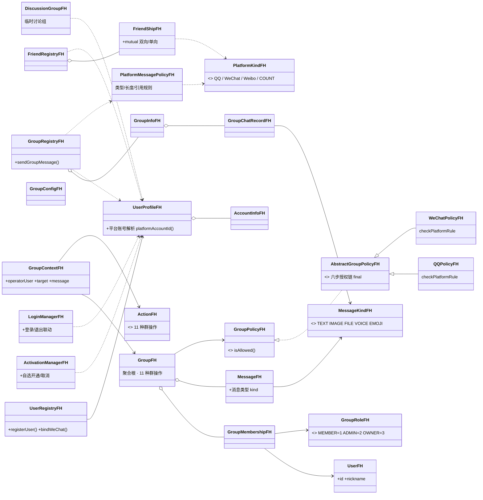

# QQ / 微信 / 微博 群组管理课程设计（C++）

> 《2026 面向对象程序课程设计》四人合作实现（Fenghui 分支整合版）
> 技术栈：C++17 · CMake · MSVC / g++（头文件主体，仅策略实现位于 `src/policy`）
> 核心主题：用面向对象设计承载“多产品（微X）体系”与平台行为差异
> —— 群管理主体统一，平台差异由策略（Strategy + Template Method）表达。

---

## 1. 项目概述

本实现以任务书的“多产品（微X）体系”为主线，把 QQ、微信、微博纳入
同一个 OO 框架，并按四个阶段逐步落地：

| 阶段 | 主题 | 说明 |
|---|---|---|
| **A** | 群组管理核心 | 用户 / 角色 / 群成员 / 群配置 / 消息实体 + `Group` 聚合根 + 11 种群操作 |
| **A** | 平台策略框架 | `Action` + `GroupContext` + `GroupPolicy`（Strategy）→ `AbstractGroupPolicy` 六步授权链（Template Method）→ `QQPolicy` / `WeChatPolicy` |
| **B** | 微X 多产品体系 | 自然人档案（QQ/微博同号、微信独立）、平台账号、自选开通服务、登录联动 |
| **C** | 社交关系 | 好友 / 微博关注（按平台隔离）、群注册表（预置群号 1001~1006）、QQ 临时讨论组 |
| **D** | 消息平台差异 | 消息类型（文本/图片/文件/语音/表情）、平台消息能力规则、群消息记录与引用回复 |

演示程序启动后自动顺序跑完 A→D 全部场景（每个场景自带“应失败”校验），
随后进入交互菜单可反复手动体验。

## 2. 目录结构

```text
include/im/
├── model/      领域实体：User、GroupRole、GroupMembership、GroupConfig、Message、Group（聚合根）
├── context/    授权上下文：Action（枚举）、GroupContext
├── policy/     策略：GroupPolicy（接口）、AbstractGroupPolicy（六步模板方法）、QQPolicy、WeChatPolicy
├── platform/   微X 产品：PlatformKind（枚举）、UserProfile（自然人档案）、AccountInfo、UserRegistry、ActivationManager、LoginManager
├── social/     社交：FriendRegistry（好友/关注）、GroupRegistry（群目录/群聊）、DiscussionGroup（QQ 临时讨论组）
└── message/    消息扩展：MessageKind（枚举）、PlatformMessagePolicy（平台消息能力规则）
src/
└── policy/     策略实现源文件（abstract_group_policy / qq_policy / wechat_policy）
app/
└── main.cpp    控制台演示程序（自动演示 A→D + 交互菜单）
```

## 3. 构建与运行

```bash
cmake -S . -B build
cmake --build build --config Debug
./build/Debug/demo_fh.exe          # Windows
# Linux/macOS: ./build/demo_fh
```

运行后无需任何输入即可看到 A→D 四段自动演示；之后出现交互菜单，
按提示操作可手动建群、邀请、禁言、撤回、转让群主等，输入 `0` 退出。

## 4. 各阶段功能与规则

### 4.1 阶段 A —— 群组管理核心

- `Group` 聚合根对外只暴露业务方法（`sendMessage`、`recallMessage`、
  `inviteMember`、`kickMember`、`muteMember`、`editGroup`、
  `publishAnnouncement`、`setAllMute`、`setAdmin`、`transferOwner`、
  `disband`），内部先授权后变更状态。
- 角色属于 `GroupMembership`，不属于 `User`；成员表以用户 ID 为键，
  天然防重复，群主在构造时注入（任意时刻至多一个）。
- 群解散后所有操作返回 `false`；管理员不能操作同级或更高角色。

### 4.2 阶段 A —— 平台策略差异（核心答辩点）

`AbstractGroupPolicy::isAllowed` 为 `final` 模板方法，固定六步：

```text
validateContext → checkMembership → checkPermission
→ checkTargetPermission → checkStateRules → checkPlatformRule(平台差异)
```

| 操作 | QQ | 微信 |
|---|---|---|
| 普通成员邀请 | 由 `memberInviteEnabled` 决定 | 仅 ADMIN+ 可邀请 |
| 设置全员禁言 | ADMIN+ 可执行 | 仅群主可执行 |
| 全员禁言中普通成员发言 | 失败 | 失败 |
| 全员禁言中 ADMIN/群主发言 | 成功 | 成功 |

### 4.3 阶段 B —— 微X 多产品体系

- 一人一档案（自然人），在多个微X 服务各有一个账号；
- **QQ 与微博共享同一号码**；**微信独立号码**，可绑定一个 QQ 号；
- 用户**自选开通**任意服务（未开通则登录失败），可随时取消（须先退出登录）；
- 登录与开通联动：先开通后登录、重复开通幂等、在线不可取消等。

### 4.4 阶段 C —— 社交关系

- 好友按平台隔离：QQ / 微信是**双向好友**，微博是**单向关注**（关注≠好友）；
- 需要双方都拥有该平台账号（如加微信好友须双方绑定微信号）；
- 群注册表预置官方群：QQ 1001/1002、微信 1003/1004、微博 1005/1006，
  自建群自 1007 起自动分配群号；
- QQ 临时讨论组：容量小、**任何成员可邀请**、成员自由退组、仅发起人可解散
  （微信群无此概念，作为平台差异演示点）。

### 4.5 阶段 D —— 消息平台差异与群消息扩展

| 消息能力 | QQ 群 | 微信群 | 微博群 |
|---|---|---|---|
| 消息类型 | 全部 | 禁文件（简化） | 仅文本 / 表情（简化） |
| 文本长度上限 | 8000 | 5000 | 1000 |
| 引用回复 | 支持 | 支持 | 不支持 |

> 以上为课程简化口径，已在代码注释中声明，不代表真实平台规则。
> 视图渲染仅作“同一条内容在不同产品下的形态”示意。

- `Message` 可声明消息类型；群消息发送前由 `PlatformMessagePolicy`
  校验类型 / 长度 / 引用能力，通过后追加到群聊记录（记录条数设上限，
  超出自动淘汰最早记录）。

## 5. 面向对象设计要点

1. **Strategy Pattern**：`Group` 依赖 `GroupPolicy` 接口而非具体平台，
   新增平台主要“新增一个 Policy 实现”。
2. **Template Method**：公共授权流程（成员、角色、目标、状态、平台）
   集中在 `AbstractGroupPolicy`，平台子类只覆写最后一步
   `checkPlatformRule`，保证“两平台一致的规则”不会被漏掉或复制。
3. **聚合根**：`Group` 集中维护业务不变量（人数上限、防重复、单群主、
   解散不可操作），外部不能直接修改成员/消息容器。
4. **多产品身份**：`UserProfile`（自然人）对多平台账号做统一建模，
   社交关系、群成员、消息能力全部落到“平台 × 账号”维度，从而在同一
   套代码里自然表达 QQ / 微信 / 微博的差异。
5. **模式克制**：不为演示而堆抽象——阶段 C/D 的平台差异均以集中规则类
   （好友差异、群号规则、消息能力）收敛，不用万能参数对象。

## 6. 类图



## 7. 演示输出示例

自动演示按“成功/失败”双语校验展示（关键失败项标注“应失败”），例如：

```text
======== 自动演示：群消息平台差异与群消息扩展（阶段 D） ========
  [D1] 小明在微信群 1003 发文件「合同.docx」：失败（应失败：微信群禁文件，简化口径）
  [D2] 小红在 QQ 群 1001 引用回复小明：成功（QQ/微信支持引用）
  [D3] · [QQ] 小明 17:32:18 [文件] 架构图.pdf
======== 阶段 D 自动演示结束 ========
```

## 8. 相关文档

| 文档 | 内容 |
|---|---|
| `design.md` | 群组管理部分的设计文档（权限矩阵、时序、模板方法说明） |
| `cpp-implementation-division.md` | 四人分工与接口冻结点（组长/用户/群/服务） |

## 9. 已知边界

- 单线程模型；无网络 / 数据库 / 真实平台接口；
- 撤回时间窗、消息类型能力等规则均为课程简化口径；
- 交互菜单使用独立于自动演示的手动数据，二者互不影响。
