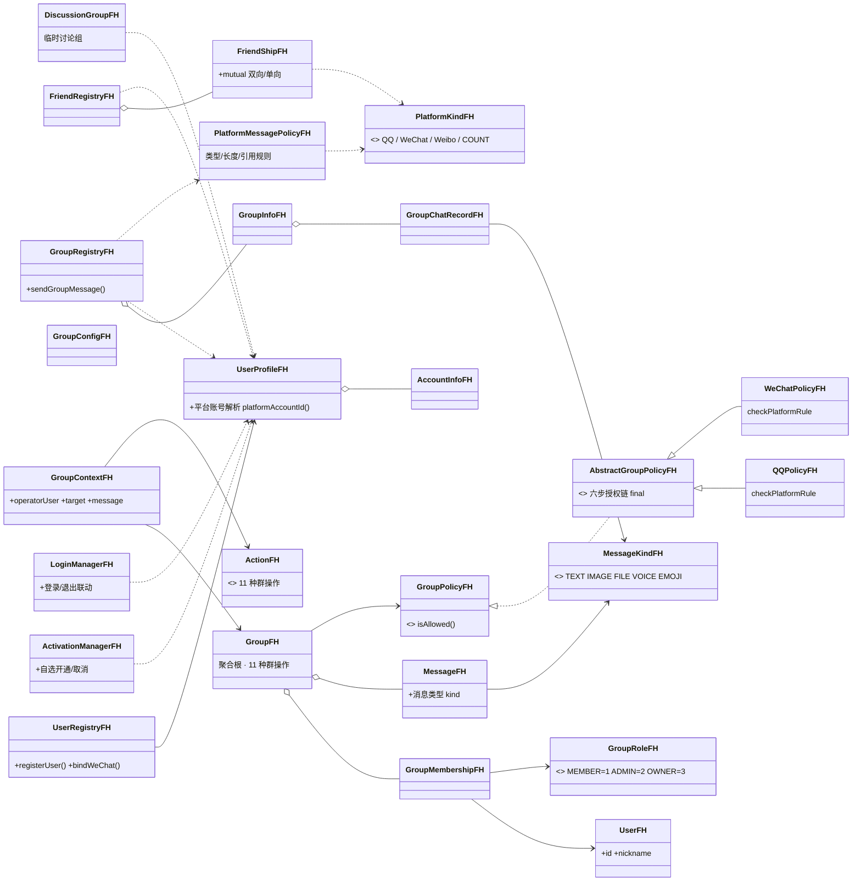

# QQ / 微信 / 微博 群组管理课程设计（C++）

> 《2026 面向对象程序课程设计》四人合作实现（Fenghui 分支整合版）
> 技术栈：C++17 · CMake · MSVC / g++（头文件主体，仅策略实现位于 `src/policy`）
> 核心主题：用面向对象设计承载“多产品（微X）体系”与平台行为差异
> —— 群管理主体统一，平台差异由策略（Strategy + Template Method）表达。

---

## 1. 项目概述

本实现以任务书的“多产品（微X）体系”为主线，把 QQ、微信、微博纳入
同一个 OO 框架，并按四个阶段逐步落地：

| 阶段 | 主题 | 说明 |
|---|---|---|
| **A** | 群组管理核心 | 用户 / 角色 / 群成员 / 群配置 / 消息实体 + `Group` 聚合根 + 11 种群操作 |
| **A** | 平台策略框架 | `Action` + `GroupContext` + `GroupPolicy`（Strategy）→ `AbstractGroupPolicy` 六步授权链（Template Method）→ `QQPolicy` / `WeChatPolicy` |
| **B** | 微X 多产品体系 | 自然人档案（QQ/微博同号、微信独立）、平台账号、自选开通服务、登录联动 |
| **C** | 社交关系 | 好友 / 微博关注（按平台隔离）、群注册表（预置群号 1001~1006）、QQ 临时讨论组 |
| **D** | 消息平台差异 | 消息类型（文本/图片/文件/语音/表情）、平台消息能力规则、群消息记录与引用回复 |
| **E** | 测试与界面工程 | 自包含断言框架 + 9 个 ctest 回归套件（97 用例）、手动测试工作台（热键 / 表单 / 分屏 / 失败原因提示） |

演示程序默认进入**手动测试工作台**：按真实 IM 客户端操作逻辑组织界面
（选择自然人与服务 → 官方群大厅/建群 → 会话内发消息与群管理），支持单键
热键、表单输入、数据展示区、成功/失败提示与错误恢复，可覆盖 A→D 全流程；
加参数 `--demo` 可先自动跑完 A→D 全部演示场景（每个场景自带“应失败”校验）。

## 2. 目录结构

```text
include/im/
├── model/      领域实体：User、GroupRole、GroupMembership、GroupConfig、Message、Group（聚合根）
├── context/    授权上下文：Action（枚举）、GroupContext
├── policy/     策略：GroupPolicy（接口）、AbstractGroupPolicy（六步模板方法）、QQPolicy、WeChatPolicy
├── platform/   微X 产品：PlatformKind（枚举）、UserProfile（自然人档案）、AccountInfo、UserRegistry、
│               ActivationManager、LoginManager、PersistUtil（存档行式转义工具）
├── social/     社交：FriendRegistry（好友/关注）、FriendShip、GroupRegistry（群目录/群聊）、
│               GroupInfo、GroupChatRecord、DiscussionGroup（QQ 临时讨论组）
└── message/    消息扩展：MessageKind（枚举）、PlatformMessagePolicy（平台消息能力规则）
src/
└── policy/     策略实现源文件（abstract_group_policy / qq_policy / wechat_policy）
app/
├── main.cpp        程序入口（--demo 自动演示 / 默认进手动工作台）
├── client_ui.hpp   手动工作台入口声明
└── client_ui.cpp   手动测试工作台实现（热键操作 + 分屏展示 + 错误反馈）
tests/              9 个回归套件（共 97 个用例）+ 自包含断言框架 fh_mini_test.hpp

运行期生成（已加入 .gitignore）：save_activation_fh.dat / save_friends_fh.dat / save_groups_fh.dat
```

## 3. 构建与运行

```bash
cmake -S . -B build
cmake --build build --config Debug
./build/Debug/demo_fh.exe          # Windows：默认进入手动测试工作台
./build/Debug/demo_fh.exe --demo   # 先自动跑完 A→D 演示再进工作台
# Linux/macOS: ./build/demo_fh [--demo]
```

进入工作台后先选择演示账号（或按 `R` 注册），按 `H` 查看操作说明与建议
测试路径。所有按钮均为单键热键（按数字/字母即触发，无需回车）；需要输入
文本时按提示输入、直接回车可取消；每一步都会在提示条显示成功或失败原因。

### 自动化测试（阶段 E · 迁移回归保障）

自包含断言框架（`tests/fh_mini_test.hpp`），离线环境无需下载 GoogleTest：

```bash
cmake --build build --config Debug
ctest --test-dir build -C Debug --output-on-failure     # 预期：9/9 全部通过
```

九个回归套件（共 **97 个用例，全部通过**）与阶段对应：

| 套件 | 覆盖 | 对应阶段 |
|---|---|---|
| `group_core_test` | 领域实体校验、聚合根 11 种操作、撤回时间窗、转让/解散、切换模式 | A |
| `abstract_policy_test` | 六步授权链、成员关系、禁言状态、撤回归属与窗口边界 | A |
| `qq_wechat_policy_test` | QQ/微信差异矩阵（邀请、全员禁言、发言） | A |
| `platform_service_test` | 多产品号码体系、开通资格、登录联动 | B |
| `social_message_test` | 好友/关注隔离、群注册表、临时讨论组、消息能力与记录上限 | C/D |
| `regression_tests` | 真实性逻辑验证：构造校验、权限迁移、邀请矩阵、平台隔离、解散后状态、全员禁言、时间窗边界 | A/B/C/D |
| `e2e_integration_test` | 端到端真实场景：群生命周期、官方群全流程、讨论组、登录联动、好友隔离、消息淘汰 | A/B/C/D |
| `requirement_alignment_test` | **对照课程任务书逐条验证**：号码体系与群/好友列表、好友备注修改、共同好友、跨服务推荐添加、预置群号、入群/挨踢/群成员查询、QQ 申请制与微信推荐制、微信群仅群主特权、讨论组仅 QQ、三类信息断电保存、登录联动 | A/B/C/D |
| `requirement_alignment_comprehensive_test` | **任务书全量补强**：用户基本信息与好友/群列表、好友增删查改闭环、全平台共同好友、跨服务推荐全部前置条件、预置群号 1001~1006、加/退/挨踢/查成员、入群规则与讨论组、切换群管理模式后成员保留、开通管理、登录联动、断电保存完整往返 | A/B/C/D |

## 4. 各阶段功能与规则

### 4.1 阶段 A —— 群组管理核心

- `Group` 聚合根对外只暴露业务方法（`sendMessage`、`recallMessage`、
  `inviteMember`、`kickMember`、`muteMember`、`editGroup`、
  `publishAnnouncement`、`setAllMute`、`setAdmin`、`transferOwner`、
  `disband`），内部先授权后变更状态。
- 角色属于 `GroupMembership`，不属于 `User`；成员表以用户 ID 为键，
  天然防重复，群主在构造时注入（任意时刻至多一个）。
- 群解散后所有操作返回 `false`；管理员不能操作同级或更高角色。

### 4.2 阶段 A —— 平台策略差异（核心答辩点）

`AbstractGroupPolicy::isAllowed` 为 `final` 模板方法，固定六步：

```text
validateContext → checkMembership → checkPermission
→ checkTargetPermission → checkStateRules → checkPlatformRule(平台差异)
```

| 操作 | QQ | 微信 |
|---|---|---|
| 普通成员邀请 | 由 `memberInviteEnabled` 决定 | 禁止（微信群仅群主可推荐加入） |
| 设置全员禁言 | ADMIN+ 可执行 | 仅群主可执行 |
| 全员禁言中普通成员发言 | 失败 | 失败 |
| 全员禁言中 ADMIN/群主发言 | 成功 | 成功 |

> 任务书 3.(3)：QQ 群有以群主为核心的管理员制度，微信群仅有群主为
> 特权账号。微信群中管理员角色不产生任何特权（邀请、禁言、踢人均仅
> 群主）；从 QQ 群动态切换为微信群时成员数据不受伤，权限按当前策略
> 重新解释。

### 4.3 阶段 B —— 微X 多产品体系

- 一人一档案（自然人），在多个微X 服务各有一个账号；
- **QQ 与微博共享同一号码**；**微信独立号码**，可绑定一个 QQ 号；
- 用户**自选开通**任意服务（未开通则登录失败），可随时取消（须先退出登录）；
- 登录与开通联动：先开通后登录、重复开通幂等、在线不可取消等。

### 4.4 阶段 C —— 社交关系

- 好友按平台隔离：QQ / 微信是**双向好友**，微博是**单向关注**（关注≠好友）；
- 需要双方都拥有该平台账号（如加微信好友须双方绑定微信号）；
- 好友信息管理（任务书 2.(1)）：添加、修改（**备注名**，视角属于设置者）、
  删除、查询；
- 共同好友查询（任务书 2.(2)）：任意微X 之间好友列表交集；微博为
  “共同关注”；
- **跨服务推荐添加好友**（任务书 2.(2)、6.(3)）：依据本人开通的另一服务
  的好友关系一键添加（如微信添加 QQ 推荐好友），`recommendFriendsFrom`
  给出可推荐列表，`addFriendFromRecommendation` 完成添加；
- 群注册表预置官方群：QQ 1001/1002、微信 1003/1004、微博 1005/1006，
  自建群自 1007 起自动分配群号；
- 入群规则（任务书 3.(3)）：**QQ 群可申请加入**（`joinGroup`），
  **微信群只能推荐加入**（直接申请被拒，须群内成员经
  `inviteIntoGroup` 推荐好友进入）；
- 群管理（任务书 3.(2)）：加入、退出、**挨踢**（`kickMember`：QQ 群按
  群主>管理员>普通成员分级授权；微信群仅群主）、查询群成员
  （`memberIdsOf`）；QQ 群管理员由群主任命（`setGroupAdmin`），
  微信群无管理员制度；
- QQ 临时讨论组：容量小、**任何成员可邀请**、成员自由退组、仅发起人可解散
  （微信群无此概念，作为平台差异演示点）。

### 4.4.1 断电保存（任务书 6.(1) 与优化(2)）

- 开通服务情况（`UserRegistryFH`）、群成员信息（`GroupRegistryFH`）、
  好友信息（`FriendRegistryFH`）均可保存到文件；
- 统一模式：`setPersistencePath(path)` 在容器配置（实例化）时读入，
  容器析构时自动写回；行式文本格式，字段以 `0x1F` 分隔，自由文本
  （昵称/群名/消息/备注）做最小转义；
- 群号续编：加载后自建群号从“现有最大群号+1”继续分配；
- **main/工作台已接入**：手动测试工作台启动即从存档文件恢复数据、
  退出时写回（`save_activation_fh.dat` / `save_friends_fh.dat` /
  `save_groups_fh.dat`）；`--demo` 阶段 C 演示含“进程一写回 → 进程二
  重启加载”的完整断电保存往返；
- 通讯录菜单支持：添加/删除好友与关注、**修改好友备注**、
  **查询共同好友（含微博共同关注）**、**跨服务推荐添加好友**。

### 4.5 阶段 D —— 消息平台差异与群消息扩展

| 消息能力 | QQ 群 | 微信群 | 微博群 |
|---|---|---|---|
| 消息类型 | 全部 | 禁文件（简化） | 仅文本 / 表情（简化） |
| 文本长度上限 | 8000 | 5000 | 1000 |
| 引用回复 | 支持 | 支持 | 不支持 |

> 以上为课程简化口径，已在代码注释中声明，不代表真实平台规则。
> 视图渲染仅作“同一条内容在不同产品下的形态”示意。

- `Message` 可声明消息类型；群消息发送前由 `PlatformMessagePolicy`
  校验类型 / 长度 / 引用能力，通过后追加到群聊记录（记录条数设上限，
  超出自动淘汰最早记录）。

## 5. 面向对象设计要点

1. **Strategy Pattern**：`Group` 依赖 `GroupPolicy` 接口而非具体平台，
   新增平台主要“新增一个 Policy 实现”。
2. **Template Method**：公共授权流程（成员、角色、目标、状态、平台）
   集中在 `AbstractGroupPolicy`，平台子类只覆写最后一步
   `checkPlatformRule`，保证“两平台一致的规则”不会被漏掉或复制。
3. **聚合根**：`Group` 集中维护业务不变量（人数上限、防重复、单群主、
   解散不可操作），外部不能直接修改成员/消息容器。
4. **多产品身份**：`UserProfile`（自然人）对多平台账号做统一建模，
   社交关系、群成员、消息能力全部落到“平台 × 账号”维度，从而在同一
   套代码里自然表达 QQ / 微信 / 微博的差异。
5. **模式克制**：不为演示而堆抽象——阶段 C/D 的平台差异均以集中规则类
   （好友差异、群号规则、消息能力）收敛，不用万能参数对象。

## 6. 类图



## 7. 演示输出示例

自动演示按“成功/失败”双语校验展示（关键失败项标注“应失败”），例如：

```text
======== 自动演示：群消息平台差异与群消息扩展（阶段 D） ========
  [C2] 小明直接申请加入微信群 1003：失败（应失败：微信群只能推荐加入）
  [C2] 小明自建微信群“家人群”并推荐小红加入（微信群只能推荐加入）：成功 / 成功
  [D1] 小明在微信群 1007 发文件「合同.docx」：失败（应失败：微信群禁文件，简化口径）
  [D2] 小红在 QQ 群 1001 引用回复小明：成功（QQ/微信支持引用）
  [D3] · [QQ] 小明 17:32:18 [文件] 架构图.pdf
======== 阶段 D 自动演示结束 ========
```

## 8. 相关文档

| 文档 | 内容 |
|---|---|
| `design.md` | 群组管理部分的设计文档（权限矩阵、时序、模板方法说明） |
| `cpp-implementation-division.md` | 四人分工与接口冻结点（组长/用户/群/服务） |
| `docs/class-diagram.md` | FH 分支全量类图（Mermaid，含关键时序） |
| `TEST_REPORT.md` | 测试报告：9 套件 97 用例逐项结果、需求覆盖度与代码质量检验 |
| `DESIGN_VERIFICATION_REPORT.md` | 设计步骤回归检查报告（对照任务书“三、设计步骤”四步逐条核对） |

## 9. 已知边界

- 单线程模型；无网络 / 数据库 / 真实平台接口；
- 撤回时间窗、消息类型能力等规则均为课程简化口径；
- 手动工作台与 `--demo` 自动演示共用一个进程内“数据世界”，多次操作数据持续累积，
  便于连贯验证；工作台**启动即从存档文件加载、退出时写回**，因此重启后数据保留
  （删除 `save_activation_fh.dat` / `save_friends_fh.dat` / `save_groups_fh.dat`
  即恢复初始状态）；
- 任务书 6.(5) 的 QQ 点对点 TCP 通信为选做项，当前未实现。
