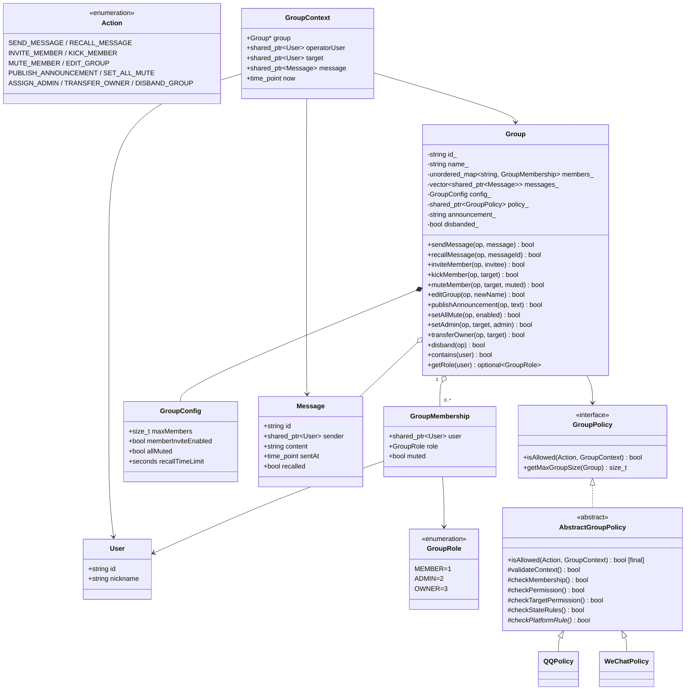
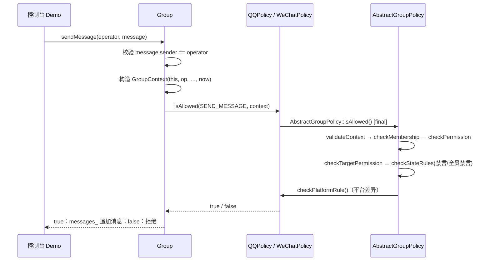

# QQ / 微信群组管理课程设计项目设计文档（C++ 版 · 合并版）

> 版本：2.1（FH 分支落地修订，2026-09）
> 语言与工具链：C++17、CMake、GoogleTest（课程环境不便时可退化为标准库 `assert`；FH 分支已落地自包含断言 + ctest）
> 核心主题：Strategy Pattern + Template Method 处理 QQ / 微信群组行为差异
> 说明：本文合并并取代原 Java 版设计文档（`group-platform-policy-design.md`）与本文件的历史初稿，两版冲突的裁决记录见附录 A。
> FH 落地说明：正文规则为权威基线；代码实现统一 **FH 后缀 + `include/im/`** 布局（阶段 A~D 全部完成，回归测试已接入 ctest）。正文中的 `include/group/...` 路径与无后缀类名均为早期参考骨架表述，实际以 `include/im/*_fh.hpp` 为准（完整映射见 `cpp-implementation-division.md`“落地状态”表）。

## 1. 项目概述

### 1.1 项目目标

设计并实现一个简化的跨平台群组管理领域模型，支持 QQ 群和微信群的共同业务，以及由平台策略决定的行为差异。

系统重点不是还原真实产品的全部功能，而是建立一套职责清晰、可测试、可扩展、不过度设计的面向对象模型。

### 1.2 设计原则

1. `Group` 负责群组状态和业务操作，不出现任何 `if (platform == QQ)` 式分支。
2. `GroupPolicy` 表达平台策略；`QQPolicy` 与 `WeChatPolicy` 只实现平台差异。
3. 公共权限流程集中在 `AbstractGroupPolicy`（模板方法），避免两个平台重复实现；**两平台完全一致的规则必须上提到父类**，不留在平台子类中。
4. `GroupContext` 只保存一次授权判断所需的最小上下文，不是万能参数对象，不放任意参数字典。
5. 角色属于 `GroupMembership`，不属于 `User`：同一用户在不同群可以有不同角色。
6. 当前只固定 `OWNER / ADMIN / MEMBER` 三种角色，不为尚未出现的平台或角色预留抽象。
7. 业务规则优先于设计模式；不为了展示模式而强行制造平台差异。

最终结构：

```text
Group
  └── GroupPolicy（接口）
        └── AbstractGroupPolicy（固定公共授权流程）
              ├── QQPolicy
              └── WeChatPolicy
```

## 2. 功能范围

### 2.1 本期功能

- 创建群组并绑定 QQ 或微信策略，构造时注入群主
- 添加、移除（邀请、踢出）群成员
- 发送、撤回消息（撤回受时间窗约束）
- 修改群名称、发布群公告
- 禁言 / 解除禁言单个成员
- 设置或解除全员禁言
- 设置 / 撤销管理员（仅群主）
- 转让群主（原子交换角色）
- 解散群组
- 校验群人数上限
- 根据角色、成员状态和平台规则判断操作是否允许

### 2.2 明确不做

- 数据库、网络通信、登录认证
- 多进程或微服务部署、线程安全（本项目按单线程模型设计）
- 复杂消息类型和媒体存储
- 真实 QQ/微信接口对接
- 通用权限框架、规则引擎、插件系统
- 与真实平台完全一致的商业规则

这些内容可作为后续扩展，但不进入本课程设计的核心实现。演示使用控制台程序即可。

## 3. 领域模型

### 3.1 核心概念

| 概念 | 职责 |
|---|---|
| `User` | 用户身份（`id` + 昵称），不直接保存群内角色 |
| `Group` | 群组聚合根，维护成员、消息、公告、配置、策略和解散状态 |
| `GroupMembership` | 用户加入某个群后的关系对象，保存角色和禁言状态 |
| `GroupRole` | 群内角色枚举：`OWNER(3)`、`ADMIN(2)`、`MEMBER(1)` |
| `GroupConfig` | 群可变配置：最大人数、成员邀请开关、全员禁言、撤回时间窗 |
| `Message` | 群消息实体：发送者、内容、时间、撤回状态 |
| `Action` | 需要被策略判断的操作类型（11 种） |
| `GroupContext` | 一次权限判断所需的最小上下文 |
| `GroupPolicy` | 平台策略接口 |

### 3.2 角色归属

角色不能放在 `User` 中：

```text
User
 ├── 在群 A 中是 OWNER
 └── 在群 B 中可能只是 MEMBER
```

因此正确关系是：

```text
Group ── 1..* ── GroupMembership ── 1 ── User
                        │
                        └── GroupRole
```

### 3.3 权限模型

权限判断分为三层：**公共角色权限**（按角色等级）→ **公共状态约束**（禁言、撤回时间窗等，两平台一致）→ **平台差异规则**（仅 QQ / 微信不同之处）。

#### 3.3.1 公共权限矩阵

| Action | OWNER | ADMIN | MEMBER | 需 target | 需 message | 说明 |
|---|---:|---:|---:|---|---|---|
| `SEND_MESSAGE` | ✓ | ✓ | ✓ | 否 | 是 | 还需通过禁言状态检查（见 3.3.3） |
| `RECALL_MESSAGE` | ✓ | ✓ | ✓ | 否 | 是 | 普通成员仅限本人消息；全部受撤回时间窗约束 |
| `INVITE_MEMBER` | ✓ | ✓ | 见平台差异 | 是 | 否 | 被邀请者必须当前不在群内 |
| `KICK_MEMBER` | ✓ | ✓ | ✗ | 是 | 否 | 不能操作同级或更高角色 |
| `MUTE_MEMBER` | ✓ | ✓ | ✗ | 是 | 否 | 不能操作同级或更高角色 |
| `EDIT_GROUP` | ✓ | ✓ | ✗ | 否 | 否 | 修改群名称等群信息 |
| `PUBLISH_ANNOUNCEMENT` | ✓ | ✓ | ✗ | 否 | 否 | 发布群公告 |
| `SET_ALL_MUTE` | ✓ | ✓ | ✗ | 否 | 否 | 公共权限 ADMIN+；微信平台规则收紧为仅群主 |
| `ASSIGN_ADMIN`（2.0 新增） | ✓ | ✗ | ✗ | 是 | 否 | 仅群主任免管理员；目标当前角色校验由 `Group` 兜底 |
| `TRANSFER_OWNER` | ✓ | ✗ | ✗ | 是 | 否 | 原子交换角色，原群主降为 `MEMBER` |
| `DISBAND_GROUP` | ✓ | ✗ | ✗ | 否 | 否 | 解散后群不可继续操作 |

角色等级：`OWNER(3) > ADMIN(2) > MEMBER(1)`。

#### 3.3.2 平台差异表

只有下表中的行为存在平台差异，其余 Action 的平台规则一律放行：

| Action | QQPolicy | WeChatPolicy |
|---|---|---|
| `INVITE_MEMBER` | `memberInviteEnabled` 开启时普通成员可邀请；关闭时仅 ADMIN+ | 仅 ADMIN+ 可邀请，普通成员禁止 |
| `SET_ALL_MUTE` | ADMIN+ 可执行 | 仅 OWNER 可执行 |

> 裁决说明：初稿矩阵中“微信邀请默认禁止 / 管理员以上”与代码（`isPrivileged`）存在矛盾，合并版统一为“仅 ADMIN+ 可邀请”；“微信管理员能否设置全员禁言”在两版文档中表述不一，合并版统一为“仅群主”。

#### 3.3.3 公共状态约束（两平台一致，置于父类）

- **发言**：被单员禁言的普通成员不能发送消息；全员禁言期间普通成员不能发送消息；OWNER / ADMIN 不受两种禁言影响。
- **撤回**：消息撤回受 `GroupConfig.recallTimeLimit` 时间窗约束；普通成员只能撤回本人消息，OWNER / ADMIN 可撤回任何消息；已撤回消息不可再次撤回。

> 裁决说明：初稿中“全员禁言判断”在 QQ / 微信两个策略中重复实现，且 `GroupMembership.muted` 字段从未被任何检查消费。合并版将两平台一致的状态约束上提为公共步骤 `checkStateRules`，消除重复并修复禁言失效问题。

## 4. UML 类图



## 5. 参考代码骨架（C++17）

以下代码为实现参考。为保持文档可读，省略了部分普通 getter 和注释；正式实现时应补齐参数校验与测试。仓库目录中，`domain.hpp` 的内容按第 7 节目录结构拆分为 `model/domain.hpp`、`context/action.hpp`、`context/group_context.hpp` 三个头文件。

### 5.1 领域对象、Action 和 Context

```cpp
// include/group/model/domain.hpp
#pragma once
#include <chrono>
#include <memory>
#include <optional>
#include <stdexcept>
#include <string>
#include <vector>

enum class GroupRole { MEMBER = 1, ADMIN = 2, OWNER = 3 };

enum class Action {
    SEND_MESSAGE, RECALL_MESSAGE, INVITE_MEMBER,
    KICK_MEMBER, MUTE_MEMBER, EDIT_GROUP, PUBLISH_ANNOUNCEMENT,
    SET_ALL_MUTE, ASSIGN_ADMIN, TRANSFER_OWNER, DISBAND_GROUP
};

struct User {
    std::string id;
    std::string nickname;
};

struct GroupConfig {
    std::size_t maxMembers{500};
    bool memberInviteEnabled{false};
    bool allMuted{false};
    std::chrono::seconds recallTimeLimit{120};

    void validate() const {
        if (maxMembers == 0 || recallTimeLimit < std::chrono::seconds::zero())
            throw std::invalid_argument("Invalid group configuration");
    }
};

struct Message {
    std::string id;
    std::shared_ptr<User> sender;
    std::string content;
    std::chrono::system_clock::time_point sentAt;
    bool recalled{false};
    void recall() { recalled = true; }
};

struct GroupMembership {
    std::shared_ptr<User> user;
    GroupRole role{GroupRole::MEMBER};
    bool muted{false};
};

class Group;
struct GroupContext {
    Group* group{};                              // 非拥有指针，避免循环引用
    std::shared_ptr<User> operatorUser;
    std::shared_ptr<User> target;
    std::shared_ptr<Message> message;
    std::chrono::system_clock::time_point now{}; // 由 Group 注入，测试可固定
};
```

### 5.2 GroupPolicy 接口与六步模板方法

`AbstractGroupPolicy::isAllowed` 是 `final` 模板方法，固定判断顺序：**上下文合法性 → 成员关系 → 公共角色权限 → 目标权限 → 公共状态约束 → 平台差异**。子类只能实现最后一步。

```cpp
// include/group/policy/group_policy.hpp
#pragma once
#include "group/model/domain.hpp"

class GroupPolicy {
public:
    virtual ~GroupPolicy() = default;
    virtual bool isAllowed(Action action, const GroupContext& context) const = 0;

    // 群人数上限的解释点：默认读取群配置；若将来平台有硬上限，
    // 覆写为 min(configuredLimit, platformLimit)，本期不写死人数。
    virtual std::size_t getMaxGroupSize(const Group& group) const;
};
```

```cpp
// include/group/policy/abstract_group_policy.hpp
#pragma once
#include "group_policy.hpp"

class AbstractGroupPolicy : public GroupPolicy {
public:
    bool isAllowed(Action action, const GroupContext& context) const final;
    std::size_t getMaxGroupSize(const Group& group) const override;

protected:
    virtual bool checkPlatformRule(Action action,
                                   const GroupContext& context) const = 0;

    bool validateContext(Action, const GroupContext&) const;
    bool checkMembership(Action, const GroupContext&) const;
    bool checkPermission(Action, const GroupContext&) const;
    bool checkTargetPermission(Action, const GroupContext&) const;
    bool checkStateRules(Action, const GroupContext&) const;
    bool isPrivileged(const GroupContext&) const;
};
```

```cpp
// src/policy/abstract_group_policy.cpp
#include "group/policy/abstract_group_policy.hpp"

bool AbstractGroupPolicy::isAllowed(Action action, const GroupContext& c) const {
    return validateContext(action, c)
        && checkMembership(action, c)
        && checkPermission(action, c)
        && checkTargetPermission(action, c)
        && checkStateRules(action, c)
        && checkPlatformRule(action, c);
}

std::size_t AbstractGroupPolicy::getMaxGroupSize(const Group& g) const {
    return g.getConfig().maxMembers;
}

bool AbstractGroupPolicy::validateContext(Action action, const GroupContext& c) const {
    if (!c.group || !c.operatorUser) return false;
    const bool needsTarget =
        action == Action::INVITE_MEMBER || action == Action::KICK_MEMBER
     || action == Action::MUTE_MEMBER   || action == Action::TRANSFER_OWNER
     || action == Action::ASSIGN_ADMIN;
    if (needsTarget && !c.target) return false;
    if ((action == Action::SEND_MESSAGE || action == Action::RECALL_MESSAGE)
        && !c.message) return false;
    return true;
}

bool AbstractGroupPolicy::checkMembership(Action action, const GroupContext& c) const {
    if (!c.group->contains(c.operatorUser)) return false;
    switch (action) {
    case Action::KICK_MEMBER: case Action::MUTE_MEMBER:
    case Action::TRANSFER_OWNER: case Action::ASSIGN_ADMIN:
        return c.group->contains(c.target);       // 目标必须在群内
    case Action::INVITE_MEMBER:
        return !c.group->contains(c.target);      // 被邀请者必须当前不在群
    default:
        return true;
    }
}

bool AbstractGroupPolicy::checkPermission(Action action, const GroupContext& c) const {
    const auto role = c.group->getRole(c.operatorUser);
    if (!role) return false;
    switch (action) {
    case Action::SEND_MESSAGE: case Action::RECALL_MESSAGE:
    case Action::INVITE_MEMBER:
        return true;                              // 由状态检查与平台规则收紧
    case Action::KICK_MEMBER: case Action::MUTE_MEMBER:
    case Action::EDIT_GROUP: case Action::PUBLISH_ANNOUNCEMENT:
    case Action::SET_ALL_MUTE:
        return *role >= GroupRole::ADMIN;
    case Action::ASSIGN_ADMIN: case Action::TRANSFER_OWNER:
    case Action::DISBAND_GROUP:
        return *role == GroupRole::OWNER;
    }
    return false;
}

bool AbstractGroupPolicy::checkTargetPermission(Action action, const GroupContext& c) const {
    if (action != Action::KICK_MEMBER && action != Action::MUTE_MEMBER) return true;
    const auto op = c.group->getRole(c.operatorUser);
    const auto target = c.group->getRole(c.target);
    return op && target && *op > *target;         // 不能操作同级或更高角色
}

bool AbstractGroupPolicy::checkStateRules(Action action, const GroupContext& c) const {
    const auto& cfg = c.group->getConfig();
    switch (action) {
    case Action::SEND_MESSAGE:
        if (c.group->isMuted(c.operatorUser) && !isPrivileged(c)) return false;
        return isPrivileged(c) || !cfg.allMuted;
    case Action::RECALL_MESSAGE:
        if (c.message->recalled) return false;    // 已撤回消息不可再撤
        if (!isPrivileged(c)) {
            const auto& sender = c.message->sender;
            if (!sender || !c.operatorUser || sender->id != c.operatorUser->id)
                return false;                     // 普通成员仅限本人消息
        }
        return c.now <= c.message->sentAt + cfg.recallTimeLimit;  // 时间窗
    default:
        return true;
    }
}

bool AbstractGroupPolicy::isPrivileged(const GroupContext& c) const {
    const auto role = c.group->getRole(c.operatorUser);
    return role == GroupRole::OWNER || role == GroupRole::ADMIN;
}
```

### 5.3 QQPolicy 与 WeChatPolicy

平台子类只保留真正的平台差异。初稿中重复的 `SEND_MESSAGE` 全员禁言判断和两个子类完全相同的 `getMaxGroupSize` 实现已删除（分别上提到 `checkStateRules` 与父类默认实现）。

```cpp
// include/group/policy/qq_policy.hpp
#pragma once
#include "abstract_group_policy.hpp"

class QQPolicy final : public AbstractGroupPolicy {
protected:
    bool checkPlatformRule(Action action, const GroupContext& c) const override;
};
```

```cpp
// src/policy/qq_policy.cpp
#include "group/policy/qq_policy.hpp"

bool QQPolicy::checkPlatformRule(Action action, const GroupContext& c) const {
    const auto& cfg = c.group->getConfig();
    switch (action) {
    case Action::INVITE_MEMBER:
        return cfg.memberInviteEnabled || isPrivileged(c);
    case Action::SET_ALL_MUTE:
        return isPrivileged(c);                   // QQ：管理员以上
    default:
        return true;
    }
}
```

```cpp
// include/group/policy/wechat_policy.hpp
#pragma once
#include "abstract_group_policy.hpp"

class WeChatPolicy final : public AbstractGroupPolicy {
protected:
    bool checkPlatformRule(Action action, const GroupContext& c) const override;
};
```

```cpp
// src/policy/wechat_policy.cpp
#include "group/policy/wechat_policy.hpp"

bool WeChatPolicy::checkPlatformRule(Action action, const GroupContext& c) const {
    switch (action) {
    case Action::INVITE_MEMBER:
        return isPrivileged(c);                   // 微信：仅管理员以上
    case Action::SET_ALL_MUTE:
        return c.group->getRole(c.operatorUser) == GroupRole::OWNER;  // 仅群主
    default:
        return true;
    }
}
```

### 5.4 Group 聚合根

`Group` 负责协调授权与状态变化：为每个业务操作构造 `GroupContext`，调用策略授权，通过后执行状态变更，并集中维护业务不变量（成员唯一、人数上限、单群主、解散不可操作）。成员表以 `User::id` 为键的 `unordered_map` 存储，天然防止重复入群，查找 O(1)。

```cpp
// include/group/model/group.hpp
#pragma once
#include <unordered_map>
#include "domain.hpp"
#include "group/policy/group_policy.hpp"

class Group {
public:
    Group(std::string id, std::string name, GroupConfig config,
          std::shared_ptr<GroupPolicy> policy, std::shared_ptr<User> owner)
        : id_(std::move(id)), name_(std::move(name)),
          config_(std::move(config)), policy_(std::move(policy)) {
        config_.validate();
        if (id_.empty() || name_.empty())
            throw std::invalid_argument("Invalid group identity");
        if (!policy_) throw std::invalid_argument("policy is required");
        if (!owner || owner->id.empty())
            throw std::invalid_argument("owner is required");
        members_.emplace(owner->id,
                         GroupMembership{owner, GroupRole::OWNER, false});
    }

    // —— 业务操作：先授权，后变更状态 ——

    bool sendMessage(const std::shared_ptr<User>& op,
                     const std::shared_ptr<Message>& message) {
        if (!message || !message->sender || !op
            || message->sender->id != op->id) return false;  // 发送者须为本人
        GroupContext c{this, op, nullptr, message, std::chrono::system_clock::now()};
        if (!execute(Action::SEND_MESSAGE, c)) return false;
        messages_.push_back(message);
        return true;
    }

    bool recallMessage(const std::shared_ptr<User>& op, const std::string& messageId) {
        auto message = findMessage(messageId);
        if (!message) return false;
        GroupContext c{this, op, nullptr, message, std::chrono::system_clock::now()};
        if (!execute(Action::RECALL_MESSAGE, c)) return false;
        message->recall();
        return true;
    }

    bool inviteMember(const std::shared_ptr<User>& op,
                      const std::shared_ptr<User>& invitee) {
        GroupContext c{this, op, invitee, nullptr, std::chrono::system_clock::now()};
        return execute(Action::INVITE_MEMBER, c) && addMember(invitee);
    }

    bool kickMember(const std::shared_ptr<User>& op,
                    const std::shared_ptr<User>& target) {
        GroupContext c{this, op, target, nullptr, std::chrono::system_clock::now()};
        return execute(Action::KICK_MEMBER, c) && members_.erase(idOf(target)) == 1;
    }

    bool muteMember(const std::shared_ptr<User>& op,
                    const std::shared_ptr<User>& target, bool muted = true) {
        GroupContext c{this, op, target, nullptr, std::chrono::system_clock::now()};
        if (!execute(Action::MUTE_MEMBER, c)) return false;
        membershipOf(target).muted = muted;
        return true;
    }

    bool editGroup(const std::shared_ptr<User>& op, const std::string& newName) {
        if (newName.empty()) return false;
        GroupContext c{this, op, nullptr, nullptr, std::chrono::system_clock::now()};
        if (!execute(Action::EDIT_GROUP, c)) return false;
        name_ = newName;
        return true;
    }

    bool publishAnnouncement(const std::shared_ptr<User>& op, const std::string& text) {
        if (text.empty()) return false;
        GroupContext c{this, op, nullptr, nullptr, std::chrono::system_clock::now()};
        if (!execute(Action::PUBLISH_ANNOUNCEMENT, c)) return false;
        announcement_ = text;
        return true;
    }

    bool setAllMute(const std::shared_ptr<User>& op, bool enabled) {
        GroupContext c{this, op, nullptr, nullptr, std::chrono::system_clock::now()};
        if (!execute(Action::SET_ALL_MUTE, c)) return false;
        config_.allMuted = enabled;
        return true;
    }

    bool setAdmin(const std::shared_ptr<User>& op,
                  const std::shared_ptr<User>& target, bool admin) {
        GroupContext c{this, op, target, nullptr, std::chrono::system_clock::now()};
        if (!execute(Action::ASSIGN_ADMIN, c)) return false;
        auto& m = membershipOf(target);
        const GroupRole wanted = admin ? GroupRole::ADMIN : GroupRole::MEMBER;
        if (m.role == wanted || m.role == GroupRole::OWNER) return false;
        m.role = wanted;
        return true;
    }

    bool transferOwner(const std::shared_ptr<User>& op,
                       const std::shared_ptr<User>& target) {
        if (!op || !target || op->id == target->id) return false;
        GroupContext c{this, op, target, nullptr, std::chrono::system_clock::now()};
        if (!execute(Action::TRANSFER_OWNER, c)) return false;
        membershipOf(op).role = GroupRole::MEMBER;    // 原子交换角色
        membershipOf(target).role = GroupRole::OWNER;
        return true;
    }

    bool disband(const std::shared_ptr<User>& op) {
        GroupContext c{this, op, nullptr, nullptr, std::chrono::system_clock::now()};
        if (!execute(Action::DISBAND_GROUP, c)) return false;
        disbanded_ = true;
        members_.clear();
        return true;
    }

    // —— 查询接口（不暴露可变集合） ——

    bool addMember(const std::shared_ptr<User>& user) {
        if (!user || user->id.empty() || contains(user)) return false;
        if (members_.size() >= policy_->getMaxGroupSize(*this)) return false;
        members_.emplace(user->id,
                         GroupMembership{user, GroupRole::MEMBER, false});
        return true;
    }

    bool contains(const std::shared_ptr<User>& user) const {
        return user && members_.count(user->id) > 0;
    }

    bool isMuted(const std::shared_ptr<User>& user) const {
        auto it = members_.find(idOf(user));
        return it != members_.end() && it->second.muted;
    }

    std::optional<GroupRole> getRole(const std::shared_ptr<User>& user) const {
        auto it = members_.find(idOf(user));
        if (it == members_.end()) return std::nullopt;
        return it->second.role;
    }

    const std::string& getId() const { return id_; }
    const std::string& getName() const { return name_; }
    const GroupConfig& getConfig() const { return config_; }
    const std::string& getAnnouncement() const { return announcement_; }
    bool isDisbanded() const { return disbanded_; }
    const std::unordered_map<std::string, GroupMembership>&
    members() const { return members_; }
    const std::vector<std::shared_ptr<Message>>& messages() const { return messages_; }

private:
    bool execute(Action action, const GroupContext& c) const {
        return !disbanded_ && policy_->isAllowed(action, c);
    }

    static const std::string& idOf(const std::shared_ptr<User>& user) {
        static const std::string empty;
        return user ? user->id : empty;
    }

    GroupMembership& membershipOf(const std::shared_ptr<User>& user) {
        return members_.at(idOf(user));
    }

    std::shared_ptr<Message> findMessage(const std::string& id) const {
        for (const auto& m : messages_)
            if (m->id == id) return m;
        return nullptr;
    }

    std::string id_, name_;
    std::unordered_map<std::string, GroupMembership> members_;
    std::vector<std::shared_ptr<Message>> messages_;
    GroupConfig config_;
    std::shared_ptr<GroupPolicy> policy_;
    std::string announcement_;
    bool disbanded_{false};
};
```

## 6. 核心调用链与时序

### 6.1 发送消息（时序图）



### 6.2 邀请成员（调用链）

```text
Group.inviteMember(op, invitee)
  → GroupContext{op, invitee}
  → execute()：六步授权链
      QQ：memberInviteEnabled 开启或管理员以上
      微信：管理员以上
  → addMember(invitee)：查重 + 人数上限（policy.getMaxGroupSize）
```

## 7. 项目目录与构建

```text
group-platform-policy/
├── CMakeLists.txt
├── README.md
├── docs/
│   └── group-platform-policy-design-cpp.md
├── include/group/
│   ├── model/{domain.hpp, group.hpp}
│   ├── context/{action.hpp, group_context.hpp}
│   └── policy/{group_policy.hpp, abstract_group_policy.hpp, qq_policy.hpp, wechat_policy.hpp}
├── src/
│   ├── model/group.cpp
│   └── policy/{abstract_group_policy.cpp, qq_policy.cpp, wechat_policy.cpp}
├── app/main.cpp
└── tests/{group_test.cpp, abstract_policy_test.cpp, qq_policy_test.cpp, wechat_policy_test.cpp}
```

```cmake
cmake_minimum_required(VERSION 3.16)
project(group_platform_policy CXX)
set(CMAKE_CXX_STANDARD 17)
set(CMAKE_CXX_STANDARD_REQUIRED ON)

add_library(group_core
    src/model/group.cpp
    src/policy/abstract_group_policy.cpp
    src/policy/qq_policy.cpp
    src/policy/wechat_policy.cpp)
target_include_directories(group_core PUBLIC include)

add_executable(demo app/main.cpp)
target_link_libraries(demo PRIVATE group_core)

# GoogleTest（离线环境可删除此段，改用 assert 简易测试）
include(FetchContent)
FetchContent_Declare(googletest
    URL https://github.com/google/googletest/archive/refs/tags/v1.14.0.zip)
FetchContent_MakeAvailable(googletest)
enable_testing()
add_executable(group_tests
    tests/group_test.cpp tests/abstract_policy_test.cpp
    tests/qq_policy_test.cpp tests/wechat_policy_test.cpp)
target_link_libraries(group_tests PRIVATE group_core GTest::gtest_main)
include(GoogleTest)
gtest_discover_tests(group_tests)
```

```bash
cmake -S . -B build
cmake --build build
ctest --test-dir build --output-on-failure
```

## 8. 设计模式与答辩说明

### 8.1 Strategy Pattern

`Group` 依赖 `GroupPolicy` 接口，而不是依赖具体平台：

```cpp
Group qq("g1", "QQ 群", config, std::make_shared<QQPolicy>(), owner);
Group wx("g2", "微信群", config, std::make_shared<WeChatPolicy>(), owner);
```

答辩说明：

> 群组的核心状态和业务流程不因平台变化而变化，平台差异被封装在策略对象中，因此新增平台时主要新增 Policy，而不是修改 Group。

### 8.2 Template Method

`AbstractGroupPolicy::isAllowed()` 是 `final` 模板方法，固定六步公共检查顺序，最后调用抽象的 `checkPlatformRule()`。

答辩说明：

> 成员检查、角色权限、目标权限、状态约束是共同流程，平台差异只位于最后一步。这样避免 QQPolicy 和 WeChatPolicy 复制相同的权限代码，也保证“两平台一致的规则”永远不会被某个平台子类遗漏。

### 8.3 聚合根与封装

`Group` 作为群组聚合根，外部通过 `sendMessage`、`kickMember` 等业务方法修改状态，而不是直接操作成员列表。

答辩说明：

> 业务不变量由 Group 集中维护：群人数上限、群已解散不可操作、成员不能重复添加、任意时刻至多一个群主、转让群主原子完成。

### 8.4 为什么不继续增加抽象

当前不引入 `PermissionService`、`RuleEngine`、多层 `MessagePolicy` 或泛化角色系统：

- 当前业务只有两种平台和三种角色；
- 公共权限流程已经足够集中；
- 再增加抽象会让课程项目难以实现和解释；
- 未来若出现真实新需求，再根据重复和变化点重构。

## 9. 实现注意事项

1. 身份判断统一使用 `User::id`，不比较智能指针或对象地址。
2. 成员表以 `User::id` 为键的 `std::unordered_map` 存储，天然防止重复入群；`contains` / `emplace` 即完成查重。
3. 角色属于 `GroupMembership`；`User` 不持有任何群内状态。
4. `GroupContext` 只含授权所需最小字段（group / operatorUser / target / message / now），不使用 `std::any`、`void*` 或任意参数字典；业务参数（新群名、禁言开关值等）由 `Group` 方法直接处理。
5. 授权通过 ≠ 业务一定成功：目标重复、消息缺失、群已解散、设管理员时目标角色不符等由 `Group` 兜底校验。
6. `Group` 构造时注入群主，保证任意时刻至多一个 `OWNER`；`transferOwner` 在同一方法内原子交换两个角色。
7. 查询接口返回 `const` 引用或值拷贝，不暴露可变集合。
8. 时间规则统一使用 `std::chrono`；策略依赖 `GroupContext.now`（由 `Group` 注入）而非直接读系统时钟，测试时注入固定时间即可复现边界。
9. 智能指针约定：`User` / `Message` / `GroupPolicy` 用 `std::shared_ptr` 共享持有；`GroupContext` 对 `Group` 使用原生指针（非拥有），避免循环引用。
10. 构造期非法参数抛 `std::invalid_argument`；业务期拒绝统一返回 `bool`，需要错误原因时再演进为结果对象。
11. 本项目按单线程模型设计，不做加锁；如需并发，作为后续扩展。
12. `getMaxGroupSize` 的默认实现读取群配置；平台硬上限钩子保留（覆写为 `min(configuredLimit, platformLimit)`），本期不写死平台人数。
13. 群解散后 `execute` 恒为 `false`，成员表清空，消息不可再发送或撤回。

## 10. 测试建议

### 10.1 实体与聚合测试（group_test.cpp）

- 空用户 ID、空群名称、非法配置（人数为 0、负时间窗）应抛出异常。
- 相同用户（相同 `id`）不能重复入群。
- 超过 `maxMembers` 时不能继续添加。
- 构造后群主为 `OWNER`，且群内至多一个 `OWNER`。
- 转让群主后原群主降为 `MEMBER`，新群主成为 `OWNER`；不能转让给自己。
- 设管理员：群主可将 `MEMBER` 升为 `ADMIN`、可将 `ADMIN` 降回 `MEMBER`；不能操作群主；管理员无权设管理员。
- 消息发送者与操作者不一致时发送失败。
- 群解散后任何操作返回 `false`。

### 10.2 公共权限与状态测试（abstract_policy_test.cpp）

- 群外用户不能执行任何群操作。
- 邀请已在群内的用户失败。
- 普通成员不能踢人、禁言、改群名、发公告、设全员禁言或解散群。
- 管理员不能踢或禁言管理员、群主（同级保护）。
- 被单员禁言的普通成员不能发言；全员禁言时普通成员不能发言，管理员和群主可以发言。
- 撤回：普通成员只能撤回本人消息；超出 `recallTimeLimit` 后任何人不可撤回；已撤回消息不可再次撤回。
- 时间窗测试通过手工构造 `Message.sentAt` 与 `GroupContext.now` 复现边界（恰好等于上限应允许）。

### 10.3 QQ 策略测试（qq_policy_test.cpp）

- `memberInviteEnabled=true` 时普通成员可以邀请。
- `memberInviteEnabled=false` 时普通成员不能邀请，但管理员 / 群主可以。
- 管理员可以设置全员禁言。

### 10.4 微信策略测试（wechat_policy_test.cpp）

- 普通成员不能邀请成员；管理员和群主可以邀请成员。
- 管理员不能设置全员禁言；只有群主可以。

### 10.5 参数化测试示例（GoogleTest）

```cpp
struct RoleCase { GroupRole role; bool canMute; };

class MutePermissionTest : public ::testing::TestWithParam<RoleCase> {};

TEST_P(MutePermissionTest, OnlyAdminAndOwnerCanMute) {
    const auto& tc = GetParam();
    // 测试夹具 makeGroup()：创建群，加入指定角色成员（夹具示意）
    auto [group, actor, target] = makeGroupWithRoles(tc.role);
    EXPECT_EQ(group->muteMember(actor, target), tc.canMute);
}

INSTANTIATE_TEST_SUITE_P(PermissionMatrix, MutePermissionTest,
    ::testing::Values(RoleCase{GroupRole::OWNER, true},
                      RoleCase{GroupRole::ADMIN, true},
                      RoleCase{GroupRole::MEMBER, false}));
```

## 11. 答辩演示脚本

建议按以下顺序演示（控制台程序）：

1. 创建两个配置相同但策略不同的群：`QQPolicy` 与 `WeChatPolicy`。
2. 普通成员尝试邀请成员：QQ 在 `memberInviteEnabled` 开启时成功，微信失败；把目标换成已在群内的用户再次邀请，两种平台均失败（展示成员唯一性）。
3. 群主开启全员禁言：普通成员发送失败，管理员发送成功（展示公共状态约束）。
4. 管理员尝试设置全员禁言：QQ 成功，微信失败（展示平台差异）。
5. 管理员尝试禁言另一名管理员：失败，展示目标权限保护。
6. 普通成员尝试撤回他人消息：失败；群主撤回成功；等待超过时间窗后撤回失败（可注入固定时间演示）。
7. 群主转让群主：展示角色属于 `GroupMembership` 而不是 `User`。
8. 说明 `Group` 中没有 `if (platform == QQ)`，平台差异由策略多态完成；两平台一致的规则全部位于 `AbstractGroupPolicy`。

## 12. 后续实现步骤

1. 建立 CMake 项目骨架（第 7 节目录）。
2. 实现 `User`、`GroupRole`、`GroupMembership`、`GroupConfig`、`Message` 与 `Action`、`GroupContext`。
3. 实现 `GroupPolicy`、`AbstractGroupPolicy`（六步模板方法）及默认 `getMaxGroupSize`。
4. 实现 `QQPolicy`、`WeChatPolicy` 的 `checkPlatformRule`。
5. 实现 `Group` 聚合根及全部 11 个业务方法。
6. 编写实体、公共权限、QQ 差异、微信差异四组测试，接入 GoogleTest。
7. 编写控制台 Demo，演示同一操作在两种策略下的结果不同。
8. 补充类图、调用时序图和测试结果截图，完善 README 与答辩材料。
9. 根据测试结果修正边界条件，不再无需求地增加抽象。

## 13. 总结

```text
Group
  └── depends on GroupPolicy
                  │
        ┌─────────┴─────────┐
        │                   │
   QQPolicy            WeChatPolicy
        ▲                   ▲
        └── AbstractGroupPolicy ──┘
                  │
        Action + GroupContext（六步授权链）
```

本设计满足课程设计最重要的几个要求：领域对象清晰、职责边界明确、平台差异可替换、公共流程可复用、实现规模可控，并且能够用真实业务规则解释所使用的设计模式。

## 附录 A：合并冲突裁决记录

本文由《group-platform-policy-design.md》（Java 版 v1.0）与本文档 C++ 初稿合并而成，以下冲突点已裁决并全文统一：

| # | 冲突点 | Java 版表述 | C++ 初稿表述 | 合并裁决 |
|---|---|---|---|---|
| 1 | 微信 SET_ALL_MUTE | 矩阵标 ADMIN ✓，备注“可收紧为群主” | 矩阵写“平台决定”，代码为仅群主 | 公共权限 ADMIN+，微信平台规则收紧为仅群主 |
| 2 | 微信 INVITE_MEMBER | “管理员以上” | 矩阵写“默认禁止”（与其代码 `isPrivileged` 矛盾） | 仅 ADMIN+ 可邀请，普通成员禁止 |
| 3 | SEND_MESSAGE 全员禁言判断 | 在两个平台策略中重复实现 | 同样重复 | 上提为公共步骤 `checkStateRules`，平台子类删除该逻辑 |
| 4 | 单成员禁言 | `muted` 字段无任何检查消费 | 同 | `checkStateRules` 中统一检查，修复禁言失效 |
| 5 | RECALL_MESSAGE | 矩阵承诺但无实现 | 同 | 新增 `recallMessage` + 时间窗与消息归属规则 |
| 6 | 管理员产生途径 | 无设管理员入口 | 同 | 新增 `ASSIGN_ADMIN`（仅群主任免） |
| 7 | getMaxGroupSize | 两个子类重复实现 | 同 | 默认实现上提到 `AbstractGroupPolicy`，子类按需覆写 |
| 8 | 群主初始化 / 唯一性 | 文字提及但无代码 | 未提及 | 构造函数注入群主，天然保证单群主 |
| 9 | 成员存储 | `ArrayList` 线性查找 | `std::vector` 线性查找 | `unordered_map<id, membership>`：O(1) 查找 + 天然去重 |
| 10 | 模板方法步骤 | 5 步 | 5 步 | 6 步（新增公共状态约束步骤） |
