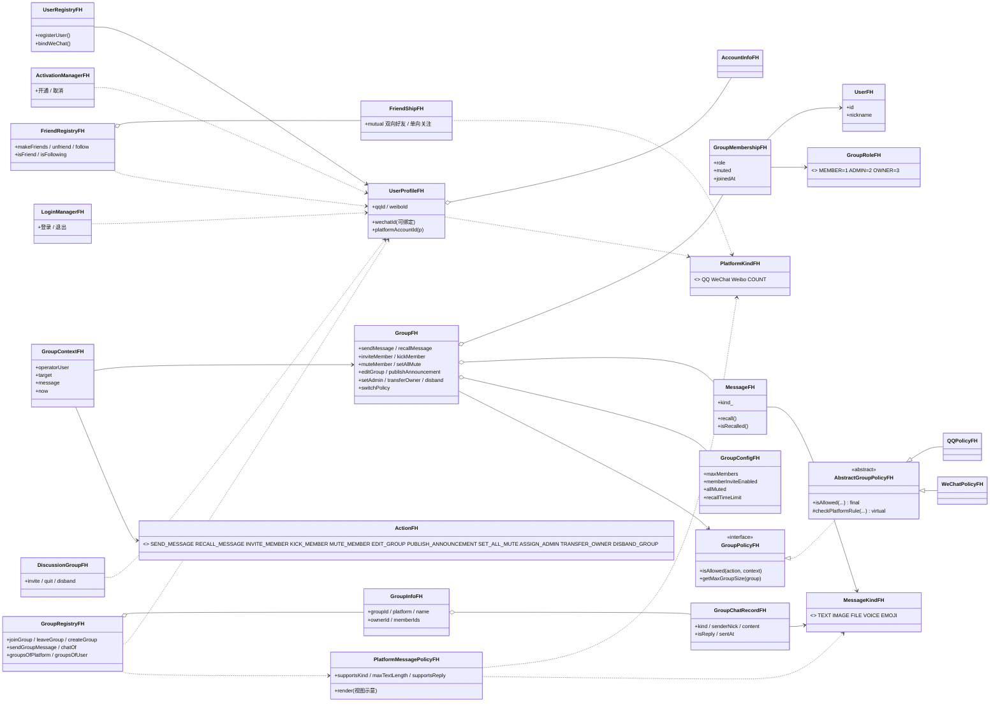
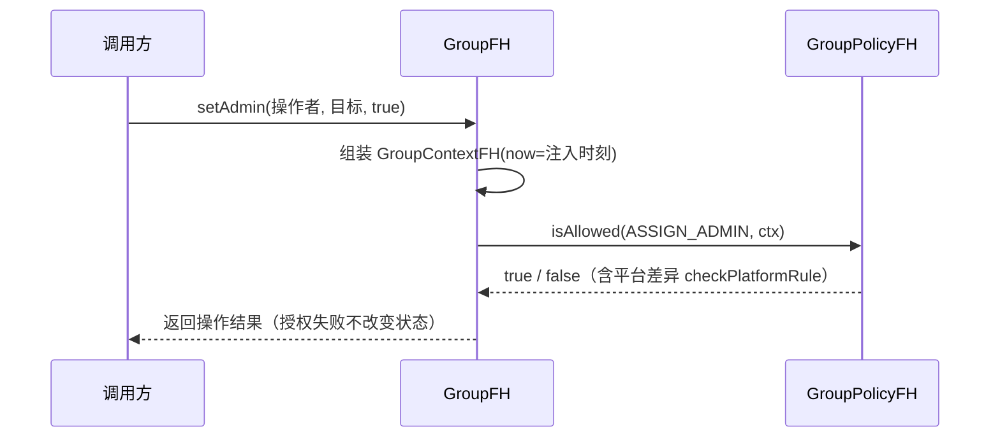
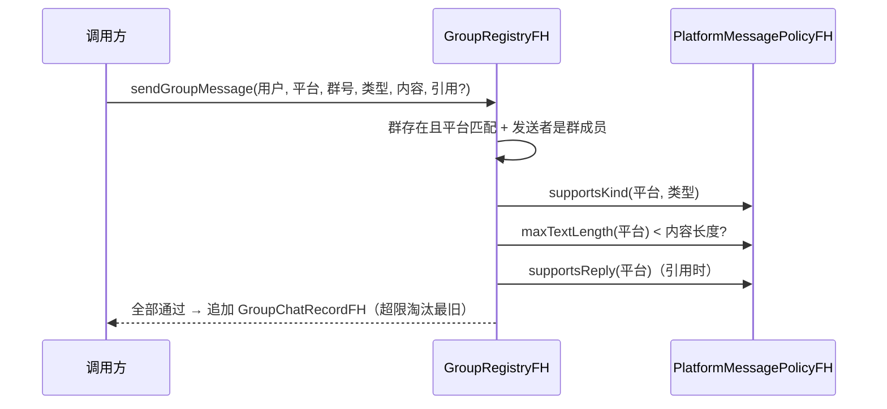

# 类图（FH 分支全量）

> 版本：阶段 A ~ D · 绘制于 2026-09
> 用于课程设计答辩与文档审查。Mermaid 需在支持 Mermaid 的 Markdown
> 阅读器（如 Typora / VS Code 插件 / GitHub）中渲染。
> 配套说明见根目录 `README.md`（各阶段功能与平台差异规则表）。

## 0. 阅读指引

类按职责分五组：

| 分组 | 目录 | 职责 |
|---|---|---|
| 领域实体 | `model/` | 用户、角色、成员、群配置、消息、群（聚合根） |
| 平台策略 | `context/` `policy/` | 授权上下文 + 群策略接口 / 抽象链 / 平台实现 |
| 多产品身份 | `platform/` | 平台枚举、自然人档案、账号、注册 / 开通 / 登录 |
| 社交关系 | `social/` | 好友与关注、群注册表与群聊、QQ 临时讨论组 |
| 消息扩展 | `message/` | 消息类型枚举、平台消息能力规则 |

## 1. 全局类图

## 2. 设计要点对照

| 面向对象手段 | 落点 |
|---|---|
| 接口抽象（Strategy） | `GroupFH` 依赖 `GroupPolicyFH`，不依赖具体平台 |
| 模板方法（Template Method） | `AbstractGroupPolicyFH::isAllowed` final，固定六步授权链，平台只覆写 `checkPlatformRule` |
| 聚合根 | `GroupFH` 对外只暴露业务方法，内部先授权后变更状态 |
| 组合优于继承 | 角色挂在 `GroupMembershipFH`（成员实例）上而非用户上 |
| 多产品统一建模 | `UserProfileFH`（自然人） + `PlatformKindFH` 维度贯穿社交与消息 |

## 3. 典型时序

### 3.1 群操作授权（阶段 A）

### 3.2 群消息发送（阶段 D）

