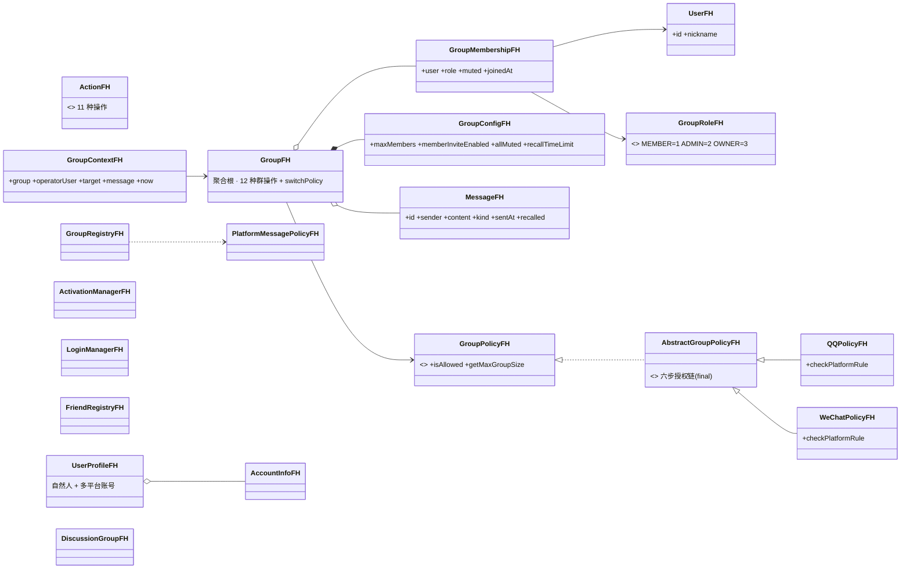
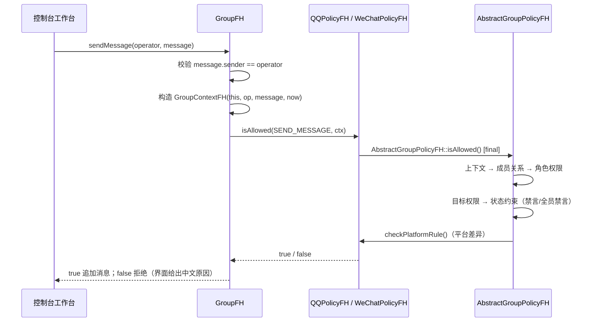

# 吉林大学

# 软件学院

# 《面向对象程序课程设计》

# 实验报告

| 项目 | 内容 |
|------|------|
| 实验地点 | 计算机大楼实验室 |
| 座位号 | （　　） |
| 班级 | 5524xx 班（xx 替换为所在班号，如 10 班填 552410 班） |
| 学号 | （　　） |
| 姓名 | （　　） |

**2025-2026 学年第 1 学期**

> 说明：文中标注「【占位】」处为待补充内容（个人信息、运行截图等），
> 提交前请替换或删除本说明。

---

## 一、设计任务分析

### 1.1 任务背景

题目为「模拟即时通信系统实现」。腾\*公司先后推出 QQ、微信、微博等微 X 产品，各产品既可独立提供服务，又相互关联，现要求对它们进行整合，形成统一的立体社交软件平台。

本设计需要回答的核心问题是：**当多个产品的业务「大部分相同、少部分不同」时，如何用面向对象的方法组织代码，使得相同部分只写一遍、不同部分可独立替换、新增产品时不必改动已有业务代码。**

### 1.2 功能需求

依据任务书，本次需实现的功能可归纳为六类：

1. **用户基本信息**：号码 ID、昵称、出生时间、T 龄、所在地、好友列表与群列表；QQ 与微博共享 ID，微信采用独立 ID 并可与 QQ 号绑定。
2. **好友管理**：好友信息的添加、修改、删除、查询；查询各微 X 之间的共同好友（如微信可添加 QQ 推荐好友）。
3. **群管理**：预置群号 1001~1006 等；加入群、退出群、挨踢、查询群成员；不同微 X 的群理念不同——QQ 群可申请加入而微信群只能推荐加入、QQ 群允许临时讨论组而微信群不允许、QQ 群有以群主为核心的管理员制度而微信群仅群主为特权账号。
4. **开通管理**：用户可自选开通 N 个微 X 服务。
5. **登录管理**：任一服务登录后，其余服务经简单确认视为自动登录。
6. **功能展示要求（main 函数）**：① 开通情况、群成员、好友信息预先保存到文件并在启动时载入内存；② 一个服务登录后，本人开通的其它服务均进入开通状态；③ 可依据本人开通的另一服务的好友关系添加好友；④ 展示某一服务的群特色功能，并在群成员数据不受伤害的前提下动态变换为其它类型群的管理特色；⑤ QQ 点对点 TCP 通信（**选做**）。

### 1.3 技术层次要求

任务书给出 5 个技术层次，本设计的对应情况如下（详细对照见 §4.1）：

| 层次 | 要求 | 本设计对应 |
|---|---|---|
| 1 基本 | 完成功能，技术不限 | 全功能实现 |
| 2 支持对象 | 正确切割类，用对象技术实现 | 单一职责的实体类 + 容器类（注册表） |
| 3 抽象、封装 | 继承或组合复用，接口保护数据 | 组合（Group 持有 Policy）+ 继承（策略类族），成员私有 + const 只读访问 |
| 4 面向对象 | 支持多态与设计原则优化 | 策略多态 + 模板方法；DIP、SRP、OCP |
| 5 优化提高 | 菜单、I/O 保存、可扩展性、管理模式可变、注释、UML 类图、类名加姓名缩写 | 全部落实（详见 §1.4） |

### 1.4 需求—实现对照

| 任务书要求 | 实现位置 | 状态 |
|---|---|---|
| 用户基本信息（ID/昵称/出生时间/T龄/所在地/好友列表/群列表） | `UserProfileFH`、`FriendRegistryFH::friendIds`、`GroupRegistryFH::groupsOfUser` | 已完成 |
| QQ 微博同号、微信独立且可绑定 QQ | `UserProfileFH::platformAccountId`、`UserRegistryFH::bindWeChat` | 已完成 |
| 好友增 / 改（备注）/ 删 / 查 | `FriendRegistryFH::makeFriends / setRemark / unfriend / friendIds` | 已完成 |
| 共同好友（含微博共同关注） | `commonFriends` / `commonFollowing` | 已完成 |
| 跨服务推荐添加好友 | `recommendFriendsFrom` / `addFriendFromRecommendation` | 已完成 |
| 预置群号 1001~1006 | `GroupRegistryFH`（QQ 1001/1002、微信 1003/1004、微博 1005/1006，自建从 1007 起） | 已完成 |
| 入群 / 退群 / 挨踢 / 查成员 | `joinGroup` / `leaveGroup`（群注册表）、`GroupFH::leaveGroup`（聚合根）/ `kickMember` / `memberIdsOf` | 已完成 |
| QQ 申请加入 vs 微信推荐加入 | `joinGroup` 对微信直接拒绝，须经 `inviteIntoGroup` 推荐 | 已完成 |
| QQ 临时讨论组（微信群无） | `DiscussionGroupFH`（容量 20、全员可邀请、仅发起人可解散） | 已完成 |
| QQ 管理员制度 vs 微信仅群主特权 | `setGroupAdmin`；`WeChatPolicyFH::checkPlatformRule`（邀请与全员禁言均限 OWNER） | 已完成 |
| 自选开通 N 个服务 | `ActivationManagerFH`（幂等、在线不可取消） | 已完成 |
| 登录联动 | `LoginManagerFH` | 已完成 |
| 6.(1) 三类信息预存文件、启动加载 | `setActivationPath` / `setPersistencePath` + 3 个 `.dat` 存档 | 已完成 |
| 6.(2) 登录后其余服务上线 | 登录联动演示与账号中心 | 已完成 |
| 6.(3) 依另一服务好友添加好友 | 通讯录「跨服务推荐添加」 | 已完成 |
| 6.(4) 群特色展示 + 动态变换管理模式 | `GroupFH::switchPolicy`（成员、消息、配置数据原样保留） | 已完成 |
| 6.(5) QQ 点对点 TCP 通信 | 未实现 | **选做，未做** |
| 优化(1) 简便菜单（数字区分、可返回） | 控制台工作台，数字键 + `0` 返回 | 已完成 |
| 优化(2) I/O 断电保存 | 见 §3.8 | 已完成 |
| 优化(3) 可扩展性 | 新增平台只需新增 Policy 与平台差异规则 | 已完成 |
| 优化(4) 管理模式动态可变 | `switchPolicy` | 已完成 |
| 优化(5) 必要注释 | 全量头文件均有职责说明 | 已完成 |
| 优化(6) UML 类图 | `reports/类图(FH分支全量).md`（Mermaid） | 已完成 |
| 优化(7) 类名加姓名缩写 | 全部类与文件名带 `FH` / `_fh` | 已完成 |

---

## 二、设计方案

### 2.1 总体架构

系统按「领域模型 / 授权上下文 / 平台策略 / 多产品 / 社交 / 消息 / 界面」分层，目录与职责如下（完整类图见 `reports/类图(FH分支全量).md`）：

```text
include/im/
├── model/      领域实体：UserFH、GroupRoleFH、GroupMembershipFH、GroupConfigFH、MessageFH、GroupFH（聚合根）
├── context/    授权上下文：ActionFH（11 种操作）、GroupContextFH
├── policy/     策略：GroupPolicyFH（接口）、AbstractGroupPolicyFH（六步模板方法）、QQPolicyFH、WeChatPolicyFH
├── platform/   微X 产品：PlatformKindFH、UserProfileFH、AccountInfoFH、UserRegistryFH、ActivationManagerFH、LoginManagerFH、PersistUtilFH
├── social/     社交：FriendRegistryFH、FriendShipFH、GroupRegistryFH、GroupInfoFH、GroupChatRecordFH、DiscussionGroupFH
└── message/    消息扩展：MessageKindFH、PlatformMessagePolicyFH
src/policy/     策略实现（仅此三处为 .cpp，其余为头文件内联）
app/            main.cpp（入口，--demo 自动演示）+ client_ui.cpp（手动测试工作台）
tests/          9 个回归套件（98 个用例）+ 自包含断言框架 fh_mini_test.hpp
```

核心结构是一条「聚合根 + 策略」的骨架：

```text
GroupFH ──依赖──> GroupPolicyFH（接口）
                        ▲
        AbstractGroupPolicyFH（六步授权链，isAllowed 为 final）
                        ▲
            ┌───────────┴───────────┐
        QQPolicyFH              WeChatPolicyFH
```

### 2.2 类层次结构与对象关系



对象之间的关键使用关系：

- `GroupFH` **组合** `GroupConfigFH`（配置随群生灭）、**聚合** `GroupMembershipFH` 与 `MessageFH`；
- `GroupMembershipFH` **关联** `UserFH` 与 `GroupRoleFH`——**角色属于「成员关系」而非「用户」**，同一用户在不同群可有不同角色；
- `GroupFH` **依赖** `GroupPolicyFH` 抽象，运行期由 `switchPolicy` 换绑具体实现；
- `GroupContextFH` 对 `GroupFH` 使用**非拥有裸指针**，避免 `shared_ptr` 循环引用；
- 上层注册表（`FriendRegistryFH` / `GroupRegistryFH`）**依赖** `UserProfileFH`，把好友、群成员、消息能力统一落到「平台 × 账号」维度。

### 2.3 关键设计决策

**决策一：用 Strategy Pattern 消除平台分支。**
群的核心业务流程（发消息、踢人、禁言、转让、解散）与平台无关，差异只集中在「谁能邀请」「谁能设全员禁言」等少数规则上。因此 `GroupFH` 只依赖 `GroupPolicyFH` 接口，构造时注入具体策略；类中**不出现任何 `if (platform == QQ)` 分支**。新增一个微 X 产品，主要是新增一个 Policy 实现，而不是修改 `GroupFH`。

**决策二：用 Template Method 固定公共授权流程。**
若把权限判断整体下放到两个平台子类，必然出现「复制粘贴」和「某个平台漏判一条规则」的风险。因此把授权过程固定为六步，`isAllowed` 声明为 `final`，平台子类**只能覆写最后一步**：

```text
validateContext → checkMembership → checkPermission
→ checkTargetPermission → checkStateRules → checkPlatformRule（多态）
```

同时规定：**两平台完全一致的规则必须上提到父类**（如禁言、撤回归属与时间窗），只有真正存在差异的规则才留在子类。

**决策三：Group 作为聚合根集中维护不变量。**
成员唯一（`unordered_map` 以用户 ID 为键，天然去重且 O(1) 查找）、人数上限、任意时刻至多一个群主（构造时注入群主）、群已解散后一切操作被拒绝——这些不变量集中在一个类中维护，外部只能通过业务方法修改状态，不能拿到成员容器的可写引用。

**决策四：角色挂在 GroupMembership 上。**
若角色放在 `User` 上，同一用户在不同群就无法拥有不同角色，也与真实 IM 不符。

**决策五：多产品身份用「自然人档案 + 平台账号」建模。**
`UserProfileFH` 表示一个自然人，`platformAccountId(platform)` 解析其在某一平台的号码：QQ 与微博返回同一号码，微信返回独立号码。社交关系、群成员、消息能力全部以「平台 × 账号」为维度，从而在同一套代码里自然表达三个产品的差异。

**决策六：模式克制，不为演示而堆抽象。**
阶段 C/D 的平台差异均以集中规则类收敛（好友差异放 `FriendRegistryFH`、群号与入群规则放 `GroupRegistryFH`、消息能力放 `PlatformMessagePolicyFH`），不引入规则引擎、插件系统或万能参数对象；`GroupContextFH` 只保存一次授权所需的最小字段，不放 `std::any` 或参数字典。

### 2.4 核心调用链（以发送消息为例）



### 2.5 权限模型

权限判断分三层：公共角色权限 → 公共状态约束 → 平台差异规则。

| Action | OWNER | ADMIN | MEMBER | QQ 差异 | 微信差异 |
|---|---:|---:|---:|---|---|
| `SEND_MESSAGE` | ✓ | ✓ | ✓ | — | — |
| `RECALL_MESSAGE` | ✓ | ✓ | 仅本人 | — | — |
| `INVITE_MEMBER` | ✓ | ✓ | 见差异 | 配置开启时允许 | **禁止（仅群主可推荐）** |
| `KICK_MEMBER` | ✓ | ✓ | ✗ | — | — |
| `MUTE_MEMBER` | ✓ | ✓ | ✗ | — | — |
| `EDIT_GROUP` / `PUBLISH_ANNOUNCEMENT` | ✓ | ✓ | ✗ | — | — |
| `SET_ALL_MUTE` | ✓ | ✓ | ✗ | ADMIN+ 可 | **仅群主可** |
| `ASSIGN_ADMIN` / `TRANSFER_OWNER` / `DISBAND_GROUP` | ✓ | ✗ | ✗ | — | — |

补充规则：踢人 / 禁言时**不能操作同级或更高角色**（`*opRole > *tgRole`）；撤回受 `recallTimeLimit` 时间窗约束且不可重复撤回；被单员禁言或全员禁言期间，普通成员不能发言，管理员与群主不受影响。

> 说明：微信群「仅群主为特权账号」这一口径直接来自任务书 3.(3)。因此在微信群中，管理员角色不产生任何特权；从 QQ 群动态切换为微信群时，成员与角色数据保留，权限按微信口径重新解释。

---

## 三、详细设计

### 3.1 领域实体

角色与成员关系（角色属于成员关系，含入群时刻）：

```cpp
enum class GroupRoleFH { MEMBER = 1, ADMIN = 2, OWNER = 3 };

class GroupMembershipFH {
    std::shared_ptr<UserFH> user_;
    GroupRoleFH role_{GroupRoleFH::MEMBER};
    bool muted_{false};
    std::chrono::system_clock::time_point joinedAt_;  // 入群时刻
};
```

群配置集中承载可变项，变更即校验（`validate()` 对非法配置抛 `std::invalid_argument`）：

```cpp
class GroupConfigFH {
    std::size_t maxMembers_{500};                 // 人数上限
    bool memberInviteEnabled_{false};             // 普通成员邀请开关（QQ 概念）
    bool allMuted_{false};                        // 全员禁言
    std::chrono::seconds recallTimeLimit_{120};   // 撤回时间窗
};
```

聚合根构造时注入群主，从而保证任意时刻至多一个 `OWNER`：

```cpp
GroupFH::GroupFH(std::string id, unsigned groupNumber, std::string name,
                 GroupConfigFH config, std::shared_ptr<GroupPolicyFH> policy,
                 std::shared_ptr<UserFH> owner) {
    config_.validate();
    if (id_.empty() || name_.empty()) throw std::invalid_argument("...");
    if (!policy_) throw std::invalid_argument("GroupFH: policy is required");
    if (!owner || owner->getId().empty()) throw std::invalid_argument("GroupFH: owner is required");
    // 注意：先取 ID 再 std::move —— emplace 实参求值顺序不确定
    const std::string ownerId = owner->getId();
    members_.emplace(ownerId, GroupMembershipFH(std::move(owner), GroupRoleFH::OWNER));
}
```

### 3.2 六步授权链（Template Method）

`isAllowed` 为 `final`，固定判断顺序，平台子类无法破坏：

```cpp
bool AbstractGroupPolicyFH::isAllowed(ActionFH action, const GroupContextFH& c) const {
    return validateContext(action, c)          // 1 上下文合法
        && checkMembership(action, c)          // 2 成员关系（邀请时目标须不在群内）
        && checkPermission(action, c)          // 3 公共角色权限
        && checkTargetPermission(action, c)    // 4 目标权限（不能操作同级/更高级）
        && checkStateRules(action, c)          // 5 公共状态约束
        && checkPlatformRule(action, c);       // 6 平台差异（多态）
}
```

两平台一致的状态约束上提到父类（此处的 `isMuted` 与 `allMuted` 判断最初曾在两个子类中重复实现，重构后统一）：

```cpp
case ActionFH::SEND_MESSAGE:
    if (c.group->isMuted(c.operatorUser) && !isPrivileged(c)) return false;  // 单员禁言
    return isPrivileged(c) || !cfg.isAllMuted();                             // 全员禁言
case ActionFH::RECALL_MESSAGE:
    if (!c.message || c.message->isRecalled()) return false;                 // 不可重复撤回
    if (!isPrivileged(c) && 发送者 != 操作者) return false;                   // 普通成员限本人
    return c.now <= c.message->getSentAt() + cfg.getRecallTimeLimit();       // 时间窗
```

### 3.3 平台策略差异

两个子类**只覆写最后一步**，且只保留真正存在差异的规则：

```cpp
// QQ：普通成员邀请由配置开关控制；ADMIN+ 可设全员禁言
case ActionFH::INVITE_MEMBER:
    return cfg.isMemberInviteEnabled() || isPrivileged(c);
case ActionFH::SET_ALL_MUTE:
    return isPrivileged(c);

// 微信：仅群主可推荐加入、仅群主可设全员禁言（任务书 3.(3)）
case ActionFH::INVITE_MEMBER:
    return c.group->getRole(c.operatorUser) == GroupRoleFH::OWNER;
case ActionFH::SET_ALL_MUTE:
    return c.group->getRole(c.operatorUser) == GroupRoleFH::OWNER;
```

`getMaxGroupSize` 的默认实现读取 `GroupConfigFH`，不在代码中写死平台人数，也避免两个子类重复实现同一段逻辑。

### 3.4 群聚合根业务方法

`GroupFH` 对外只暴露业务方法，每个方法都是「构造上下文 → 策略授权 → 通过才改状态」：

| 方法 | 说明 |
|---|---|
| `sendMessage` / `recallMessage` | 发消息（发送者须为本人）/ 撤回（归属 + 时间窗） |
| `inviteMember` / `kickMember` / `leaveGroup` | 邀请 / 挨踢 / 主动退群（群主不可直接退群） |
| `muteMember` / `setAllMute` | 单员禁言 / 全员禁言 |
| `editGroup` / `publishAnnouncement` | 改群名 / 发公告 |
| `setAdmin` / `transferOwner` / `disband` | 任免管理员 / 转让群主 / 解散 |
| `setRecallTimeLimit` / `setMemberInviteEnabled` | 群配置运行期变更（走 `EDIT_GROUP` 授权） |
| `switchPolicy` | 动态切换管理模式 |

转让群主在同一方法内**原子交换**两个角色，避免出现「无群主」或「双群主」的中间状态：

```cpp
if (!execute(ActionFH::TRANSFER_OWNER, c)) return false;
membershipOf(op).setRole(GroupRoleFH::MEMBER);    // 原群主降级
membershipOf(target).setRole(GroupRoleFH::OWNER); // 新群主升级
```

主动退群由聚合根兜底维护「群不能无主」这一不变量：

```cpp
bool GroupFH::leaveGroup(const std::shared_ptr<UserFH>& op) {
    if (disbanded_ || !op) return false;
    const auto role = getRole(op);
    if (!role || *role == GroupRoleFH::OWNER) return false;  // 群主须先转让或解散
    return members_.erase(idOf(op)) == 1;
}
```

任务书 6.(4) 的「动态变换管理特色」即换绑策略对象，成员、消息、配置数据原样保留：

```cpp
bool GroupFH::switchPolicy(const std::shared_ptr<GroupPolicyFH>& newPolicy) noexcept {
    if (disbanded_ || !newPolicy) return false;
    policy_ = newPolicy;   // 仅换策略，数据不受伤害
    return true;
}
```

### 3.5 多产品体系（任务书 1、4、5）

- **号码体系**：`UserProfileFH` 中 QQ 与微博返回同一号码，微信为独立号码并可用 `bindWeChat` 绑定一个 QQ 号；`AccountInfoFH` 记录绑定关系与平台昵称。
- **自选开通**：`ActivationManagerFH::activate` 校验资格（如开微信须先绑定微信号）、重复开通幂等；`deactivate` 要求该服务已离线（在线时取消被拒）。
- **登录联动**：`LoginManagerFH::login` 要求服务已开通；登录成功后本人其余已开通服务自动上线，对应任务书 6.(2)。
- 自然人同时持有「已开通集合」与「在线集合」，界面账号卡片实时展示三项服务的「未开通 / 已开通 / 在线」状态。

### 3.6 社交关系（任务书 2、3）

- **好友按平台隔离**：QQ / 微信为双向好友（`makeFriends` 后双方互为好友），微博为单向关注（关注 ≠ 好友，`isFriend` 与 `isFollowing` 语义分离）；删除 QQ 好友不影响微信好友关系。
- **好友信息修改**：`setRemark` 设置备注名，且备注「视角属于设置者」——A 给 B 的备注不会被 B 看到。
- **共同好友**：`commonFriends`（QQ / 微信双向好友交集）与 `commonFollowing`（微博共同关注）。
- **跨服务推荐**：`recommendFriendsFrom` 先做资格校验（本人须已开通来源与目标服务、对方须已是来源服务好友且已绑定目标服务、且尚非目标服务好友），`addFriendFromRecommendation` 完成添加，对应任务书 2.(2) 与 6.(3)。
- **群注册表**：预置官方群 1001~1006，自建群从 1007 起自动续编；QQ / 微博群可申请加入（`joinGroup`），微信群直接申请被拒、须由群内成员 `inviteIntoGroup` 推荐；群主任命管理员仅 QQ 群可用（`setGroupAdmin`）。
- **QQ 临时讨论组**：`DiscussionGroupFH` 容量 20、**任何成员都可邀请**、成员自由退组、仅发起人可解散；微信群无此概念。

### 3.7 消息平台差异（自定扩展）

| 能力 | QQ 群 | 微信群 | 微博群 |
|---|---|---|---|
| 消息类型 | 全部 | 禁文件（简化） | 仅文本 / 表情（简化） |
| 文本长度上限 | 8000 | 5000 | 1000 |
| 引用回复 | 支持 | 支持 | 不支持 |

`MessageFH` 携带 `MessageKindFH`；发送前由 `PlatformMessagePolicyFH` 校验类型、长度与引用能力；群聊天记录设 50 条上限，超出自动淘汰最早记录。以上均为课程简化口径，代码注释中已声明，不代表真实平台规则。

### 3.8 断电保存（任务书 6.(1)、优化(2)）

开通服务情况（`UserRegistryFH`）、好友信息（`FriendRegistryFH`）、群成员信息（`GroupRegistryFH`）三类数据均可持久化：

- 统一模式：`setPersistencePath(path)` 在容器实例化（构造）时读入，容器析构时自动写回；
- 行式文本格式，字段以 `0x1F` 分隔，自由文本（昵称 / 群名 / 消息 / 备注）做最小转义（`PersistUtilFH`）；
- 加载后自建群号从「现有最大群号 + 1」继续分配，避免与预置群号冲突；
- 工作台启动即从存档恢复并在提示条告知，退出时写回；`--demo` 中演示「进程一写回 → 进程二重启加载」的完整往返。

### 3.9 交互界面

控制台工作台按真实 IM 客户端的操作路径组织：选择自然人 → 账号中心（开通 / 登录）→ 群大厅（浏览与加入官方群）或创建（建群 / 讨论组）→ 会话内操作。

- **键位**：全部操作项为数字键，`0` 为「返回上级 / 进入更多操作」；账号选择、群大厅等列表型界面的功能键按列表长度**动态编号**，避免与列表项冲突。
- **反馈**：每次操作都有过程反馈，底部提示条显示成功或失败原因；失败原因按规则链给出（如「微信群仅群主可设置全员禁言（平台差异）」「不能禁言与自己同级或更高等级成员」）。
- **防呆**：文本输入直接回车即取消；解散群二次确认；无效按键提示；群主退群被拒时提示先转让或解散。
- **测试便利**：会话内「更多操作」提供切换管理模式、转让群主、解散群、退出本群、群设置（改邀请开关 / 撤回窗口，用于现场复现「超时不可撤回」）、以其他成员身份操作。

【占位：此处粘贴工作台主界面 / 会话界面运行截图 2~3 张】

### 3.10 测试设计

采用自包含断言框架（`tests/fh_mini_test.hpp`），离线环境无需下载 GoogleTest，每个测试文件生成独立可执行程序，由 ctest 汇总：

```bash
cmake -S . -B build
cmake --build build --config Debug
ctest --test-dir build -C Debug --output-on-failure   # 9/9 套件、98 用例全部通过
```

| 套件 | 覆盖内容 |
|---|---|
| `group_core_test` | 领域实体校验、聚合根 12 种操作、撤回时间窗、转让 / 解散、切换模式 |
| `abstract_policy_test` | 六步授权链、成员关系、禁言状态、撤回归属与窗口边界 |
| `qq_wechat_policy_test` | QQ / 微信差异矩阵（邀请、全员禁言、发言） |
| `platform_service_test` | 号码体系、开通资格、登录联动 |
| `social_message_test` | 好友 / 关注隔离、群注册表、讨论组、消息能力与记录上限 |
| `regression_tests` | 真实性逻辑：权限迁移、平台隔离、解散后状态、时间窗边界 |
| `e2e_integration_test` | 端到端场景：群生命周期、官方群全流程、登录联动、消息淘汰 |
| `requirement_alignment_test` | 对照任务书逐条验证 |
| `requirement_alignment_comprehensive_test` | 任务书全量补强（含退群限制、群配置变更、断电保存往返） |

【占位：此处粘贴 ctest 运行结果截图】

---

## 四、总结与体会

### 4.1 程序设计的优点

1. **平台差异被多态消化**：`GroupFH` 中没有任何平台分支，新增产品主要是新增策略类，符合开闭原则，也便于在答辩中解释「为什么这样设计」。
2. **公共流程不会漏判**：六步模板方法把「两平台一致的规则」固定在父类，从机制上避免了子类复制粘贴导致的规则遗漏。
3. **不变量集中**：成员唯一、人数上限、单群主、解散后拒绝操作等由聚合根统一维护，业务方法外部无法绕过。
4. **角色归属正确**：角色挂在 `GroupMembershipFH` 上，转让群主只是一次角色交换，不需要搬运用户数据。
5. **多产品身份统一建模**：「自然人 → 多平台账号」的结构使好友、群成员、消息能力天然按平台隔离，差异表达自然。
6. **模式克制**：没有为了展示设计模式而制造抽象，规则集中在少数几个类里，代码可读性与可解释性较好。
7. **可验证性强**：98 个用例覆盖任务书逐条要求，另有手动测试工作台支持全流程走查。

### 4.2 不足与限制

1. **单机内存模型**：无网络通信、无数据库、无真实平台接口，两个账号「同时在线」是同一进程内的模拟。
2. **任务书 6.(5) 的 QQ 点对点 TCP 通信未实现**（选做项）。
3. **规则为课程简化口径**：消息类型能力、文本长度上限、撤回时间窗等均为简化设定，不代表真实产品规则。
4. **本地正式群不落盘**：断电保存覆盖开通 / 好友 / 群注册表三类数据；为演示聚合根而创建的本地正式群仅存在于当前进程。
5. **界面为控制台**：未做可视化（课程设计后作业方向，不考核）。
6. **单线程**：未考虑并发与加锁。

### 4.3 调试过程中出现的主要问题与解决方案

| # | 问题 | 解决方案 |
|---|---|---|
| 1 | 全员禁言判断在两个平台策略中重复实现，且 `GroupMembershipFH::muted` 字段从未被任何检查消费，导致**单员禁言实际失效** | 新增公共步骤 `checkStateRules`，把两平台一致的禁言 / 撤回约束上提到父类，子类删除重复逻辑，禁言规则随之生效 |
| 2 | 微信邀请规则口径矛盾：设计文档写「管理员以上」，代码用 `isPrivileged`，而任务书 3.(3) 是「微信群仅有群主为特权账号」 | 以任务书为准统一为**仅群主可邀请 / 可设全员禁言**，同步修改策略实现、测试用例与演示文案 |
| 3 | 撤回时间窗（120 秒）在手动测试中无法触发超时分支 | 利用 `MessageFH` 可注入 `sentAt` 的构造参数，在 `--demo` 中构造「121 秒前发送」的消息复现超时；同时在界面开放撤回窗口配置，可现场验证 |
| 4 | 切换管理模式后，操作者身份仍按原平台账号计算，导致微信模式下仍用 QQ 账号操作 | 会话主循环每轮重算操作者；若当前自然人在新模式平台无账号，则降级为「只读浏览」并给出提示 |
| 5 | 群主可直接退群会导致群处于「无主」状态 | `leaveGroup` 中拒绝群主退群，并提示「请先转让群主或解散群」；补充对应测试用例 |
| 6 | MSVC 下中文注释与输出乱码 | CMake 中为 MSVC 增加 `/utf-8` 编译选项，程序入口调用 `SetConsoleOutputCP(CP_UTF8)` |
| 7 | `GroupFH` 构造函数中 `emplace` 实参求值顺序不确定，先 `std::move(owner)` 再取 ID 会解引用空指针 | 先取出 `ownerId` 再 `std::move(owner)`，并在代码注释中记录原因 |
| 8 | 演示写回的存档文件污染工作区并被误纳入版本库 | 按文件名模式加入 `.gitignore`（`save_*.dat`、`demo_save_*.dat`），演示结束用 `std::remove` 清理临时文件 |
| 9 | 加载存档后自建群号可能与预置群号冲突 | 加载后自建群号从「现有最大群号 + 1」继续分配 |
| 10 | 控制台单键读取在管道 / 重定向环境（自动化冒烟）下取不到控制台句柄 | 检测 `GetConsoleMode` 失败后回退为标准输入逐字节读取，保证非交互环境仍可运行 |
| 11 | 文档与实现漂移（README 的套件数量、重启是否保留数据等表述与代码不符） | 建立「改动后同步文档」的习惯，按代码实际状态逐项校正 README 与测试报告 |

### 4.4 认识与体会

通过本次课程设计，主要体会有三点：

1. **面向对象首先是「职责划分」，其次才是语法特性。** 真正让代码变清晰的是把「群的状态」「授权流程」「平台差异」三件事分开，而不是简单地把所有类都继承自同一个基类。
2. **「相同」比「不同」更值得抽象。** 平台差异只占少数规则，若把判断整体下放，重复的公共逻辑迟早会不一致；用模板方法把公共流程固定下来，差异只留一个覆写点，是在本次设计中收益最大的决定。
3. **文档、测试与实现必须同步。** 本次出现的多处「规则与文案矛盾」都是三者不同步造成的；把任务书条目做成可执行的断言（`requirement_alignment_test`），能在改动后立刻发现回归。

## 五、实验最新进展（截至 2026-09）

在「阶段 E · 界面工程」基线之后，本分支继续围绕"贴近真实 IM 的可演示 + 可回归"做了若干增量，所有改动均已合入 `Fenghui` 分支并经 `ctest` 全量验证。

### 5.1 界面整改

- **数字键统一**：删除 Q / W / E / R / H / C 等字母热键，0 统一为"返回 / 更多"；账号门与群大厅的功能键按列表长度动态编号，移除各界面刷新项（操作后自动重绘）。
- **正式群二级菜单**：把切换管理模式 / 转让群主 / 解散群 / 退出本群 / 群设置 / 以其他成员身份操作等低频操作收进"更多操作"二级数字菜单；修复了切换管理模式后操作身份未重算的隐患。
- **撤回超时可复现**：`--demo` 入口支持提前构造 `sentAt`，可现场演示"窗口外撤回失败、窗口内成功"；界面也可临时调小撤回窗口做对照演示。

### 5.2 群管理与配置变更

- `GroupFH` 新增 `leaveGroup`：群主不可直接退群，须先转让或解散，从权限源头避免"群主退出后群无主"的状态。
- 新增 `setRecallTimeLimit` / `setMemberInviteEnabled`，与 `GroupConfigFH::setRecallTimeLimit` 一起，全部走 `EDIT_GROUP` 授权（ADMIN+ 即可，群主永远是 ADMIN），群设置变更可在线生效。
- 文案同步：两套群体系（聚合根 9000+ vs 群注册表 1001\~1006 / 1007+）的差异说明；`busy()` 标注为 UI 反馈动画而非真实加载；修正"微信仅 ADMIN+ 可邀请"的过期表述（现规则为仅群主）。

### 5.3 测试基线

- 测试套件由 9 套件 / 97 用例扩展到 **9 套件 / 98 用例**，新增 `Comprehensive_LeaveGroupAndGroupConfigChange` 覆盖群主退群限制 + 群配置运行期变更。
- `ctest --test-dir build -C Debug --output-on-failure` 9/9 全绿。

### 5.4 文档整理

- 在 `reports/` 下集中存放 6 份项目文档：实验报告、本项目设计文档、四人 C++ 分工、类图、测试报告、设计验证报告。
- 根目录仅保留 `README.md`、课程原始任务书（`2026-面向对象程序课程设计.{md,docx}`）与构建/源码目录。
- 所有交叉引用同步到新路径，旧的英文文件名已不再出现。

### 5.5 后续可继续推进的方向

- 把群注册表（1001\~1006 / 1007+）的存档从 `JSON` 文本升级为二进制格式，减少人工校对成本。
- 在策略层之外引入"操作日志"装饰器，让 `E2E` 集成测试可重放任意操作序列，方便答辩演示。
- 若日后接入真实平台，可把"平台策略"作为可选插件动态加载，目前的 `QQPolicyFH` / `WechatPolicyFH` 已为这一改造预留接口。
